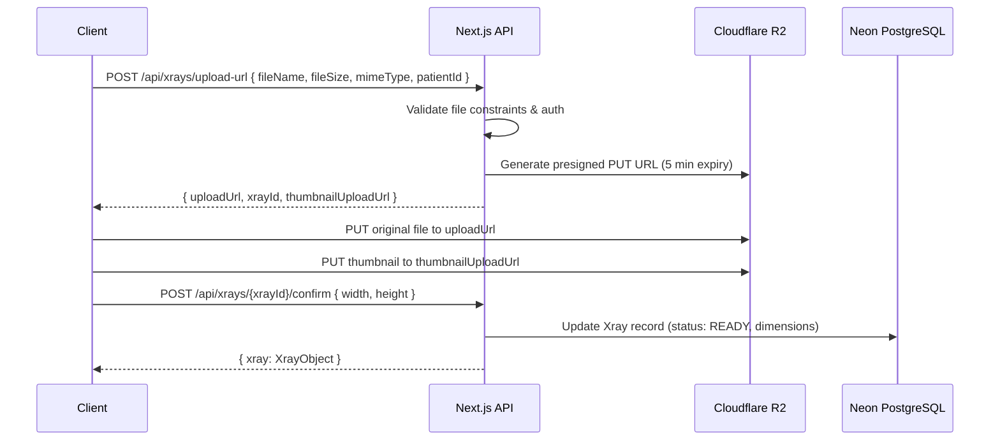
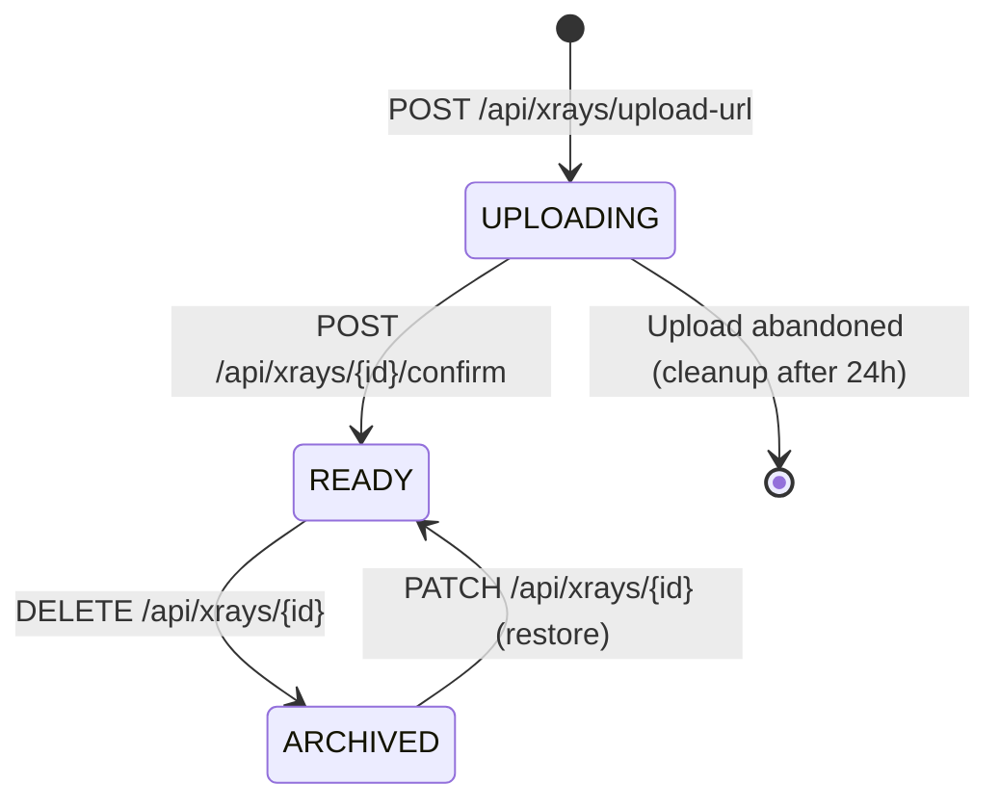

# X‑Ray Annotation Spec — Part 1: Upload & Storage

> **Series**: Part 1 of 5 — [Upload & Storage] · [Canvas Engine](./xray-annotation-spec-part2-canvas.md) · [Drawing Tools](./xray-annotation-spec-part3-tools.md) · [Measurements](./xray-annotation-spec-part4-measurements.md) · [API & Export](./xray-annotation-spec-part5-api.md)

---

## Overview

This part covers **how X‑ray images enter the system** — file validation, client‑side preprocessing, presigned upload to Cloudflare R2, database record creation, and the Prisma schema for the `Xray` model.

---

## File Constraints

| Property | Constraint |
| --- | --- |
| Max file size | 300 MB |
| Allowed extensions | `.png`, `.jpg`, `.jpeg` |
| Min dimensions | 100 × 100 px |
| Max dimensions | 16384 × 16384 px (browser canvas limit) |
| Color space | sRGB (CMYK images auto‑converted on upload) |

### MIME Types

| Extension | MIME Type |
| --- | --- |
| `.png` | `image/png` |
| `.jpg` | `image/jpeg` |
| `.jpeg` | `image/jpeg` |

---

## Upload Pipeline

```
User selects file
  → Client‑side validation (type, size, dimensions)
  → Generate thumbnail (256px longest edge, JPEG 80%)
  → Upload original to Cloudflare R2 via presigned URL
  → Upload thumbnail to R2
  → Create Xray record in DB with metadata
  → Redirect to annotation canvas
```

### Client‑Side Validation Steps

1. **File type check**: verify MIME type against allowed list before any upload
2. **File size check**: reject files > 300 MB with immediate feedback
3. **Dimension check**: load image into an offscreen `` element, read `naturalWidth` / `naturalHeight`
   - Reject if either dimension < 100 px or > 16384 px
4. **Thumbnail generation**: draw image onto `<canvas>` scaled to 256px longest edge, export as JPEG 80% quality

### Presigned Upload Flow



### R2 Storage Structure

```
/xrays/{clinicId}/{patientId}/{xrayId}/original.{ext}
/xrays/{clinicId}/{patientId}/{xrayId}/thumbnail.jpg
/xrays/{clinicId}/{patientId}/{xrayId}/exports/{exportId}.{png|pdf}
```

### Upload Progress UX

- Show progress bar during R2 upload (using `XMLHttpRequest` or `fetch` with `ReadableStream` for progress tracking)
- Display file name, size, and thumbnail preview during upload
- On success: transition to annotation canvas with the uploaded image loaded
- On failure: show error toast with retry option

---

## Data Model

### Prisma Schema — Xray Model

```prisma
model Xray {
  id                   String     @id @default(cuid())
  title                String?
  bodyRegion           BodyRegion?
  viewType             ViewType?
  status               XrayStatus @default(UPLOADING)

  // Original upload
  fileUrl              String
  fileName             String
  fileSize             Int        // bytes
  mimeType             String     // image/jpeg | image/png
  width                Int        // px — set after upload confirmation
  height               Int        // px

  // Thumbnail
  thumbnailUrl         String?

  // Calibration (written by measurement tools — see Part 4)
  isCalibrated         Boolean    @default(false)
  pixelSpacing         Float?     // mm per pixel
  calibrationMethod    CalibrationMethod?

  patientId            String
  patient              Patient    @relation(fields: [patientId], references: [id], onDelete: Cascade)

  visitId              String?
  visit                Visit?     @relation(fields: [visitId], references: [id])

  uploadedById         String     // references User.id

  annotations          Annotation[]

  createdAt            DateTime   @default(now())
  updatedAt            DateTime   @updatedAt

  @@index([patientId])
  @@index([visitId])
}

enum XrayStatus {
  UPLOADING    // presigned URL generated, file not yet confirmed
  READY        // upload confirmed, available for annotation
  ARCHIVED     // soft‑deleted / hidden from active views
}

enum BodyRegion {
  CERVICAL
  THORACIC
  LUMBAR
  PELVIS
  FULL_SPINE
  EXTREMITY
  OTHER
}

enum ViewType {
  AP           // anterior‑posterior
  LATERAL
  OBLIQUE
  PA           // posterior‑anterior
  OTHER
}

enum CalibrationMethod {
  CLINIC_DEFAULT   // inherited from Clinic.defaultPixelSpacing
  REFERENCE_MARKER // user placed a known‑size marker on the image
  MANUAL           // user entered mm/px directly
}
```

### Status Lifecycle



**Stale upload cleanup**: a scheduled job runs daily to delete `UPLOADING` records older than 24 hours (and their corresponding R2 objects if any).

---

## Error States (Upload‑Specific)

| Error | UX |
| --- | --- |
| File exceeds 300 MB | Toast: "File too large. Maximum size is 300 MB." — block upload |
| Invalid file type | Toast: "Only JPEG and PNG files are supported." — block upload |
| Dimensions exceed 16384 px | Toast: "Image dimensions exceed the maximum of 16384 × 16384 pixels." — block upload |
| Image too small (< 100 px) | Toast: "Image must be at least 100 × 100 pixels." — block upload |
| Presigned URL expired | Auto‑request new URL and retry upload silently |
| R2 upload network failure | Toast: "Upload failed. Check your connection." — show retry button |
| Confirm endpoint fails | Toast: "Could not finalize upload." — retry with exponential backoff (3 attempts) |

---

## Related Specs

- **Part 2 — Canvas Engine**: how the uploaded image is loaded onto the canvas
- **Part 4 — Measurements**: calibration tool writes `pixelSpacing` back to this model
- **Part 5 — API & Export**: full REST endpoints for Xray CRUD

---

🦴 **SmartChiro X‑Ray Annotation — Part 1 of 5**
