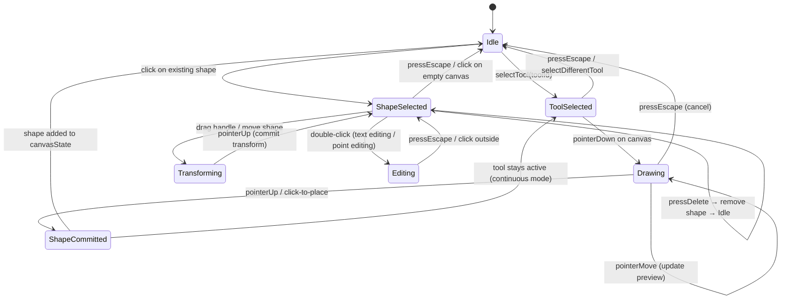

# X‑Ray Annotation Spec — Part 2: Canvas Engine

> **Series**: [Upload & Storage](./xray-annotation-spec-part1-upload.md) · [Canvas Engine] · [Drawing Tools](./xray-annotation-spec-part3-tools.md) · [Measurements](./xray-annotation-spec-part4-measurements.md) · [API & Export](./xray-annotation-spec-part5-api.md)

---

## Overview

This part covers the **canvas engine** — the viewport that hosts the X‑ray image and all annotation shapes. It defines the layout, coordinate system, zoom/pan behavior, layer architecture, selection/transform system, undo/redo, image adjustments, auto‑save, and performance strategies.

> **Canvas library**: TBD (evaluating Konva.js, Fabric.js, or custom). All structures in this spec are **library‑agnostic**.

---

## Layout — Dark Canvas with Light Chrome

```
┌──────────────────────────────────────────────────────────────────┐
│  Stripe‑style light header (breadcrumb, xray title, actions)    │
├────────┬─────────────────────────────────────────┬──────────────┤
│        │  ┌───────────────────────────────────┐  │              │
│  Tool  │  │                                   │  │   Properties │
│  Bar   │  │        DARK CANVAS AREA           │  │   Panel      │
│        │  │        (#1A1F36 bg)                │  │   (light)    │
│ (light │  │                                   │  │              │
│  bg)   │  │     X‑ray image + annotations     │  │  - Layers    │
│        │  │                                   │  │  - Shapes    │
│  56px  │  │                                   │  │  - Measure   │
│  wide  │  │                                   │  │    summary   │
│        │  └───────────────────────────────────┘  │              │
│        │  ┌───────────────────────────────────┐  │  280px wide  │
│        │  │ Zoom: 100%  │ Fit │ 1:1 │ Grid   │  │  collapsible │
│        │  └───────────────────────────────────┘  │              │
├────────┴─────────────────────────────────────────┴──────────────┤
│  Status bar: cursor position (px), measurement readout, hints   │
└──────────────────────────────────────────────────────────────────┘
```

### Canvas Area Colors

```css
--canvas-bg:            #1A1F36;  /* Dark blue‑gray background */
--canvas-border:        #2D3348;  /* Canvas region border */
--canvas-grid:          rgba(255, 255, 255, 0.06);  /* Optional alignment grid */
--canvas-crosshair:     rgba(255, 255, 255, 0.4);   /* Cursor crosshair overlay */
```

All surrounding chrome (toolbar, properties panel, header, status bar) uses the Stripe‑style light theme tokens defined in `project-overview.md`.

### Panel Dimensions

| Element | Size | Behavior |
| --- | --- | --- |
| Header bar | 48px height | Fixed, always visible |
| Tool bar (left) | 56px wide | Fixed, always visible |
| Properties panel (right) | 280px wide | Collapsible (toggle via `\` key) |
| Zoom bar (bottom of canvas) | 32px height | Fixed within canvas area |
| Status bar (bottom) | 28px height | Fixed, always visible |

---

## Coordinate System

```
Origin (0,0) ──────────────────── X+ (right)
  │
  │     Image pixels = canvas units
  │     All shape coordinates are in image‑pixel space
  │     Zoom/pan transforms are view‑only, not stored
  │
  Y+ (down)
```

- **Coordinate space**: all shape coordinates are stored in **original image pixel space** (not screen/viewport space)
- **Zoom & pan**: applied as a view transform matrix; shapes rendered at current zoom but coordinates remain in image space
- **Sub‑pixel precision**: coordinates stored as `float` with 2 decimal places max
- **View transform**: `screenPos = (imagePos × zoom) + panOffset`
- **Inverse transform**: `imagePos = (screenPos - panOffset) / zoom`

---

## Zoom & Pan

### Zoom

| Property | Value |
| --- | --- |
| Min zoom | 5% (0.05×) |
| Max zoom | 3200% (32×) |
| Default zoom | Fit to viewport |
| Zoom step (scroll) | ×1.1 per scroll tick |
| Zoom step (shortcut) | ×1.25 per press |
| Zoom anchor | Cursor position (scroll) or viewport center (shortcut) |

### Pan

| Input | Behavior |
| --- | --- |
| Hand tool (`H`) | Click and drag to pan |
| `Space + drag` | Temporary pan from any tool (releases back to previous tool on `Space` up) |
| Middle mouse button + drag | Always pans regardless of active tool |
| Touch: two‑finger drag | Pan |
| Touch: pinch | Zoom centered between fingers |

### Zoom Presets (Bottom Bar)

| Button | Behavior |
| --- | --- |
| Fit | Scale image to fit viewport with 24px padding |
| 100% | 1:1 pixel mapping |
| Zoom % display | Click to type custom zoom percentage |

### Keyboard Shortcuts — Navigation

| Shortcut | Action |
| --- | --- |
| `Space + drag` | Temporary pan (while held) |
| `Scroll wheel` | Zoom in/out (centered on cursor) |
| `Ctrl/Cmd + 0` | Fit image to viewport |
| `Ctrl/Cmd + 1` | Zoom to 100% (1:1 pixel) |
| `Ctrl/Cmd + +` | Zoom in (step: ×1.25) |
| `Ctrl/Cmd + -` | Zoom out (step: ÷1.25) |
| `H` | Activate pan/hand tool |

---

## Layer Architecture

```
TOP (highest zIndex)
│
├── Annotation shapes (user drawings, measurements)
│   ├── Shape N (zIndex: N)
│   ├── Shape ...
│   └── Shape 1 (zIndex: 1)
│
├── Image layer (the X‑ray — always below annotations, locked)
│
BOTTOM
```

- Image layer is **always locked** — cannot be selected, moved, or deleted
- Image adjustments (brightness, contrast, invert) apply to image layer only
- Shapes are reordered within the annotation layer via `[` / `]` shortcuts or drag‑and‑drop in the Layers panel

### Properties Panel — Layers Tab

Each shape listed with:
- Shape icon (by type) + label or auto‑name (e.g., "Line 3")
- Visibility toggle (eye icon)
- Lock toggle (lock icon)
- Click to select, drag to reorder

---

## Selection & Transform

### Selection

| Input | Behavior |
| --- | --- |
| Single click on shape | Select it (show bounding box + handles) |
| `Shift + click` | Add/remove from multi‑selection |
| Drag on empty canvas (Select tool) | Marquee / lasso selection |
| `Ctrl/Cmd + A` | Select all visible, unlocked shapes |

### Transform Handles

```
   rotate handle
        │
  ┌─────●─────┐
  │     │     │
  ●─────┼─────●  ← resize handles (8 points: corners + midpoints)
  │     │     │
  └─────●─────┘
```

| Handle | Behavior |
| --- | --- |
| Corner handles | Proportional resize (hold `Shift` to unlock aspect ratio) |
| Midpoint handles | Stretch in one axis |
| Rotation handle | Rotate around center (hold `Shift` to snap to 15° increments) |
| Body drag | Move shape (hold `Shift` to constrain to horizontal/vertical axis) |

### Multi‑Selection

- All selected shapes transform as a group
- Bounding box encompasses all selected shapes
- Move / rotate / delete applies to all selected
- Style changes (color, stroke width) apply to all selected

### Selection Keyboard Shortcuts

| Shortcut | Action |
| --- | --- |
| `V` | Activate select/move tool |
| `Ctrl/Cmd + A` | Select all |
| `Delete` / `Backspace` | Delete selected shape(s) |
| `Ctrl/Cmd + D` | Duplicate selected shape(s) |
| `Escape` | Deselect all |
| `[` | Send selected shape backward (zIndex - 1) |
| `]` | Bring selected shape forward (zIndex + 1) |

---

## Tool State Machine



**Continuous mode**: after committing a shape, drawing tools remain selected so the user can immediately draw another shape of the same type. Selecting the Select tool (`V`) or pressing `Escape` breaks this loop.

---

## Undo / Redo System

### Architecture — Command Pattern

```typescript
interface CanvasCommand {
  id: string;
  type: CommandType;
  timestamp: string;              // ISO 8601
  shapeBefore: BaseShape | null;  // snapshot before change (null for add)
  shapeAfter: BaseShape | null;   // snapshot after change (null for delete)
  shapeId: string;
}

type CommandType =
  | "ADD_SHAPE"
  | "DELETE_SHAPE"
  | "MODIFY_SHAPE"        // move, resize, rotate, style change
  | "REORDER_SHAPE"       // zIndex change
  | "BATCH";              // group of commands (e.g., delete multiple selected shapes)

interface UndoRedoStack {
  history: CanvasCommand[];   // committed commands
  pointer: number;            // current position in history (-1 = nothing to undo)
  maxSize: number;            // cap at 100 commands to limit memory
}
```

### Rules

- Adding a new command clears all commands after the current pointer (fork behavior)
- `Ctrl/Cmd + Z` = undo (move pointer back, restore `shapeBefore`)
- `Ctrl/Cmd + Shift + Z` = redo (move pointer forward, apply `shapeAfter`)
- History is **per‑session only** — not persisted to DB. Saving an annotation commits the final state.
- Maximum 100 commands. Oldest commands dropped FIFO when limit reached.

---

## Annotation Canvas State

The `canvasState` JSON stored in `Annotation.canvasState`:

```typescript
interface AnnotationCanvasState {
  version: 1;                     // schema version for forward compatibility
  shapes: BaseShape[];            // all shape objects (ordered by zIndex)
  viewport: {
    zoom: number;                 // last zoom level (for restoring view)
    panX: number;                 // last pan offset X
    panY: number;                 // last pan offset Y
  };
  metadata: {
    shapeCount: number;           // total shapes
    measurementCount: number;     // shapes where type is ruler | angle | cobb_angle
    lastModifiedShapeId: string | null;
  };
}
```

### Prisma Schema — Annotation Model

```prisma
model Annotation {
  id                   String   @id @default(cuid())
  label                String?  // user‑given name, e.g. "Initial assessment"
  version              Int      @default(1)

  // Canvas state — the core payload
  canvasState          Json     // AnnotationCanvasState
  canvasStateSize      Int      // byte size of canvasState JSON (for quota tracking)

  // Snapshot
  thumbnailUrl         String?  // auto‑generated preview after save

  // Image adjustment settings applied when this annotation was saved
  imageAdjustments     Json?    // ImageAdjustments

  xrayId               String
  xray                 Xray     @relation(fields: [xrayId], references: [id], onDelete: Cascade)

  createdById          String   // references User.id

  createdAt            DateTime @default(now())
  updatedAt            DateTime @updatedAt

  @@index([xrayId])
}
```

---

## Image Adjustments

Horizontal toolbar **above** the canvas (within the light chrome):

| Control | Type | Range | Default |
| --- | --- | --- | --- |
| Brightness | Slider | -100 to +100 | 0 |
| Contrast | Slider | -100 to +100 | 0 |
| Invert | Toggle button | on/off | off |
| Window Center | Slider | 0 – 255 | 128 |
| Window Width | Slider | 1 – 512 | 256 |
| Reset | Button | — | Resets all to defaults |

### Image Adjustments Schema

```typescript
interface ImageAdjustments {
  brightness: number;     // -100 to 100, default 0
  contrast: number;       // -100 to 100, default 0
  invert: boolean;        // negative image, default false
  windowCenter: number;   // for window/level control, default 128
  windowWidth: number;    // for window/level control, default 256
}
```

### Implementation

- **Brightness / Contrast / Invert**: applied as CSS filters on the image layer (GPU‑accelerated)
  ```css
  .xray-image-layer {
    filter: brightness(var(--adj-brightness))
            contrast(var(--adj-contrast))
            invert(var(--adj-invert));
  }
  ```
- **Window/Level**: radiograph‑standard intensity mapping `[center - width/2, center + width/2]` → display range. Applied as canvas pixel operation or WebGL shader (not CSS filter — CSS has no equivalent)
- Adjustments apply to **image layer only** — annotation shapes are unaffected
- Saved as part of the annotation (so different annotations on the same X‑ray can have different adjustments)

---

## Auto‑Save

| Trigger | Action |
| --- | --- |
| Every 30 seconds (if changes exist) | Auto‑save canvasState to `PUT /annotations/{id}` |
| On tool switch | Debounced save (500ms) |
| On browser `beforeunload` | Attempt save via `navigator.sendBeacon` |
| Manual `Ctrl/Cmd + S` | Immediate save |

**Conflict handling**: last‑write‑wins. No real‑time collaboration in v1 — single user per annotation session.

**Unsaved changes indicator**: dot on save button + "Unsaved changes" in status bar when local state diverges from last saved state.

---

## Performance

| Concern | Mitigation |
| --- | --- |
| Large images (300 MB, 16k px) | Progressive loading: show low‑res thumbnail first, stream full‑res tiles on demand |
| Many shapes (hundreds) | Virtual rendering: only draw shapes within visible viewport bounds |
| Freehand paths with many points | Point simplification (RDP algorithm) on `pointerUp` — see Part 3 |
| Canvas state JSON size | Monitor `canvasStateSize` in DB; warn at 5 MB, hard cap at 10 MB |
| Undo history memory | Cap at 100 commands; oldest dropped FIFO |
| Image adjustment rendering | CSS filters for brightness/contrast/invert (GPU‑accelerated); canvas pixel ops for window/level |
| Resize/transform rendering | Throttle `pointerMove` handler to 60fps via `requestAnimationFrame` |

---

## Accessibility

| Concern | Implementation |
| --- | --- |
| Keyboard navigation | All tools accessible via keyboard shortcuts; `Tab` cycles through toolbar buttons |
| Screen reader | Toolbar buttons have `aria-label`; shape list in Layers panel is a navigable `role="listbox"` |
| Color contrast | Annotation color presets all pass WCAG AA against `#1A1F36` canvas background |
| Focus indicators | Visible focus ring on all interactive elements (using `--color-border-focus: #635BFF`) |
| Reduced motion | Respect `prefers-reduced-motion`: disable animated transitions, immediate state changes |

---

## Related Specs

- **Part 1 — Upload & Storage**: how images arrive on the canvas
- **Part 3 — Drawing Tools**: shape schemas and tool behaviors that populate `canvasState`
- **Part 4 — Measurements**: measurement shapes and calibration
- **Part 5 — API & Export**: persistence and export endpoints

---

🦴 **SmartChiro X‑Ray Annotation — Part 2 of 5**
