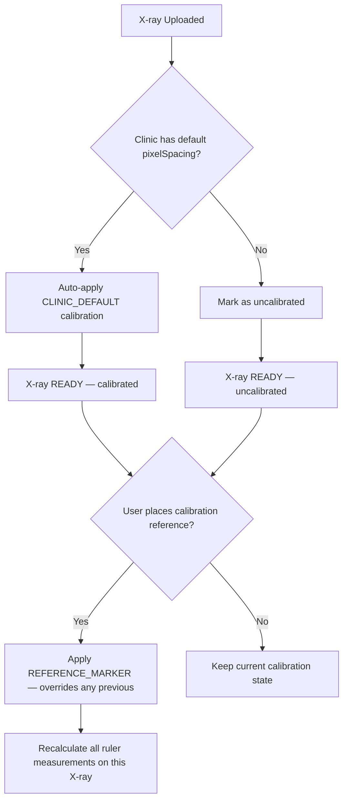

# X‑Ray Annotation Spec — Part 4: Measurements

> **Series**: [Upload & Storage](./xray-annotation-spec-part1-upload.md) · [Canvas Engine](./xray-annotation-spec-part2-canvas.md) · [Drawing Tools](./xray-annotation-spec-part3-tools.md) · [Measurements] · [API & Export](./xray-annotation-spec-part5-api.md)

---

## Overview

This part covers the **measurement tools** — Ruler (distance), Angle, Cobb Angle, and the Calibration Reference tool. These are specialized shapes that extend the `BaseShape` interface (defined in Part 3) with computed measurement data. It also covers calibration mechanics and the clinical measurement reference table.

---

## Tool Map & Shortcuts

| Tool | Shortcut | Shape Type | Purpose |
| --- | --- | --- | --- |
| Ruler | `M` | `ruler` | Distance measurement (px or mm) |
| Angle | `Shift + M` | `angle` | Three‑point angle measurement |
| Cobb Angle | `Ctrl/Cmd + Shift + M` | `cobb_angle` | Scoliosis curvature via two endplate lines |
| Calibration | `K` | `calibration_reference` | Set px‑to‑mm ratio using known reference |

---

## Default Measurement Styles

```typescript
const MEASUREMENT_DEFAULTS = {
  stroke: "#00D4AA",              // teal — distinct from drawing red
  strokeWidth: 1.5,
  labelColor: "#FFFFFF",
  labelFontSize: 12,
  
  calibrationStroke: "#FFCC00",   // yellow — visually distinct from measurements
  calibrationStrokeWidth: 2,
};
```

---

## Measurement Shape Schemas

### Ruler (`ruler`)

```typescript
interface RulerShape extends BaseShape {
  type: "ruler";
  points: [number, number, number, number]; // [x1, y1, x2, y2]
  
  // Measurement result (auto‑computed)
  measurement: {
    pixelLength: number;              // distance in pixels
    calibratedLength: number | null;  // distance in mm (null if uncalibrated)
    unit: "px" | "mm";               // current display unit
  };
  
  // Display options
  showEndTicks: boolean;              // perpendicular tick marks at endpoints, default true
  tickLength: number;                 // px, default 8
  labelPosition: "above" | "below" | "auto"; // where the measurement text appears
  labelFontSize: number;              // default 12
}
```

**Behavior**:
- Click start point, drag to end point, release to commit
- Measurement label auto‑appears alongside the line (midpoint, offset by `labelPosition`)
- If `Xray.isCalibrated === true`: shows mm value (e.g., "38.2 mm")
- If uncalibrated: shows px value with a subtle "(uncalibrated)" hint
- Hold `Shift` to constrain to 0°/45°/90° angles
- End ticks render as short perpendicular lines at each endpoint for visual clarity

**Distance Calculation**:
```
pixelLength = √((x2 - x1)² + (y2 - y1)²)
calibratedLength = pixelLength × Xray.pixelSpacing  // mm
```

**Label Rendering**:
```
Position: midpoint of line, offset 12px in labelPosition direction
Content: "38.2 mm" or "142 px (uncalibrated)"
Background: semi-transparent dark pill (#1A1F36 at 80% opacity)
Font: 12px, white, medium weight
```

---

### Angle (`angle`)

```typescript
interface AngleShape extends BaseShape {
  type: "angle";
  points: [
    number, number,   // point A (first ray endpoint)
    number, number,   // vertex V (intersection point)
    number, number    // point C (second ray endpoint)
  ];
  
  // Measurement result (auto‑computed)
  measurement: {
    degrees: number;            // angle in degrees (0–360)
    radians: number;            // angle in radians
    supplementary: number;      // 180 - degrees
  };
  
  // Display options
  arcRadius: number;            // radius of the angle arc indicator, default 30
  showSupplementary: boolean;   // show supplementary angle too, default false
  labelFontSize: number;        // default 12
}
```

**Behavior**:
- Three‑click placement:
  1. Click → place point A (first ray endpoint)
  2. Click → place vertex V (intersection point); ray A→V rendered
  3. Click → place point C (second ray endpoint); ray V→C rendered, angle computed
- Angle arc drawn at vertex between the two rays
- Measurement label placed outside the arc
- If `showSupplementary` is enabled, supplementary angle shown on the other side of the vertex

**Angle Calculation**:
```
v1 = (Ax - Vx, Ay - Vy)   // vector from vertex to point A
v2 = (Cx - Vx, Cy - Vy)   // vector from vertex to point C
angle = atan2(v1 × v2, v1 · v2)  // signed angle via cross/dot product
degrees = |angle| × (180 / π)
supplementary = 180 - degrees
```

**Preview During Placement**:
- After 1st click: dot at point A
- After 2nd click: line A→V rendered; crosshair follows cursor for point C, angle preview updates in real‑time
- After 3rd click: shape committed

---

### Cobb Angle (`cobb_angle`)

```typescript
interface CobbAngleShape extends BaseShape {
  type: "cobb_angle";
  
  // Two lines that define the Cobb angle
  line1: [number, number, number, number]; // [x1, y1, x2, y2] — superior endplate
  line2: [number, number, number, number]; // [x1, y1, x2, y2] — inferior endplate
  
  // Computed perpendiculars (auto‑generated, read‑only)
  perpendicular1: [number, number, number, number]; // perpendicular from line1
  perpendicular2: [number, number, number, number]; // perpendicular from line2
  intersection: [number, number];                     // where perpendiculars meet
  
  // Measurement result (auto‑computed)
  measurement: {
    degrees: number;            // Cobb angle value
    classification: string;     // "mild" | "moderate" | "severe"
  };
  
  // Display options
  showPerpendiculars: boolean;  // draw the perpendicular construction lines, default true
  showClassification: boolean;  // show severity label, default true
  labelFontSize: number;        // default 12
}
```

**Behavior**:
- Four‑click placement:
  1. Click → start of line 1 (superior endplate start)
  2. Click → end of line 1 (superior endplate end); line 1 rendered
  3. Click → start of line 2 (inferior endplate start)
  4. Click → end of line 2 (inferior endplate end); line 2 rendered, Cobb angle auto‑computed
- System auto‑draws perpendicular lines from each endplate line
- Perpendiculars intersect to form the Cobb angle
- Lines should be drawn along vertebral endplates (most tilted superior and inferior vertebrae)
- Label shows degrees + classification badge

**Cobb Angle Calculation**:
```
1. Compute direction vectors for each line
   dir1 = (line1.x2 - line1.x1, line1.y2 - line1.y1)
   dir2 = (line2.x2 - line2.x1, line2.y2 - line2.y1)

2. Compute perpendicular directions (rotate 90°)
   perp1 = (-dir1.y, dir1.x)
   perp2 = (-dir2.y, dir2.x)

3. Find intersection of perpendicular rays
   Solve: line1.midpoint + t × perp1 = line2.midpoint + s × perp2

4. Cobb angle = angle between perp1 and perp2
   angle = acos((perp1 · perp2) / (|perp1| × |perp2|))
   degrees = angle × (180 / π)

5. Classification:
   < 10°  → "mild"
   10–25° → "moderate"
   > 25°  → "severe"
```

**Rendering**:
- Line 1: solid, measurement stroke color
- Line 2: solid, measurement stroke color
- Perpendiculars: dashed `[6, 4]`, same color at 60% opacity
- Intersection point: small circle marker (4px radius)
- Angle arc at intersection
- Label: "17.3° — Moderate" with classification badge

**Preview During Placement**:
- After clicks 1–2: line 1 rendered
- After click 3: line 2 preview follows cursor
- After click 4: full computation and rendering

---

### Calibration Reference (`calibration_reference`)

```typescript
interface CalibrationReferenceShape extends BaseShape {
  type: "calibration_reference";
  points: [number, number, number, number]; // [x1, y1, x2, y2]
  
  // Calibration data
  knownDistance: number;          // real‑world distance in mm (user‑entered)
  pixelDistance: number;          // measured pixel distance (auto‑computed)
  computedPixelSpacing: number;  // mm per pixel = knownDistance / pixelDistance
  
  // Display
  showEndTicks: boolean;         // default true
  labelFontSize: number;         // default 12
}
```

**Behavior**:
1. User activates Calibration tool (`K`)
2. Draw a line across a known reference object in the image (e.g., a coin, ruler, or marker)
3. On release, a modal dialog appears:
   - "Enter the real‑world distance of this reference in millimeters"
   - Number input (mm), pre‑focused
   - "Apply" / "Cancel" buttons
4. On "Apply":
   - `pixelDistance` computed from the drawn line
   - `computedPixelSpacing = knownDistance / pixelDistance`
   - Parent `Xray` record updated: `isCalibrated = true`, `pixelSpacing = computedPixelSpacing`, `calibrationMethod = REFERENCE_MARKER`
   - All existing ruler measurements on this X‑ray recalculate their `calibratedLength`
   - Toast: "Calibration applied — 0.142 mm/px"
5. Calibration reference shape remains visible on canvas (yellow, distinct from other measurements)

**Recalibration**: placing a new calibration reference replaces the previous one. Only one calibration reference per X‑ray.

**Removing Calibration**:
- Delete the calibration reference shape → triggers `DELETE /api/xrays/{id}/calibrate`
- Xray reverts to `isCalibrated = false`, all ruler measurements switch back to px display

---

## Calibration System

### Calibration Sources (Priority Order)

| Source | Method | Trigger |
| --- | --- | --- |
| Calibration Reference tool | `REFERENCE_MARKER` | User draws reference line on image |
| Clinic default | `CLINIC_DEFAULT` | Auto‑applied on upload if `Clinic.calibrationEnabled && Clinic.defaultPixelSpacing` exists |
| Manual entry | `MANUAL` | User enters mm/px value directly in X‑ray settings |

### Calibration Data Flow



### Calibration Accuracy Note

- Calibration is only as accurate as the reference object and the user's line placement
- For clinical measurements requiring sub‑millimeter precision, recommend using a radiopaque ruler in the imaging plane
- Display a warning badge on measurements taken with clinic‑default calibration: "Estimated — use reference marker for precision"

---

## Measurement Properties Panel

When a measurement shape is selected, the properties panel shows measurement‑specific fields in addition to common shape properties (see Part 3).

### Ruler Properties

| Property | Display | Editable |
| --- | --- | --- |
| Pixel length | Read‑only value, e.g. "142.5 px" | No |
| Calibrated length | Read‑only value, e.g. "38.2 mm" (or "—" if uncalibrated) | No |
| Unit | Badge: "mm" (green) or "px" (yellow) | No |
| Calibrated | Badge: "Calibrated" (green) or "Uncalibrated" (yellow) | No |
| Show end ticks | Toggle | Yes |
| Label position | Dropdown: Above / Below / Auto | Yes |

### Angle Properties

| Property | Display | Editable |
| --- | --- | --- |
| Angle | Read‑only value, e.g. "17.3°" | No |
| Supplementary | Read‑only value, e.g. "162.7°" | No |
| Show supplementary | Toggle | Yes |
| Arc radius | Slider (15–60 px) | Yes |

### Cobb Angle Properties

| Property | Display | Editable |
| --- | --- | --- |
| Cobb angle | Read‑only value, e.g. "17.3°" | No |
| Classification | Badge: "Mild" / "Moderate" / "Severe" | No |
| Show perpendiculars | Toggle | Yes |
| Show classification | Toggle | Yes |

### Calibration Reference Properties

| Property | Display | Editable |
| --- | --- | --- |
| Known distance | Value in mm | Yes (triggers recalculation on change) |
| Pixel distance | Read‑only value | No |
| Pixel spacing | Read‑only value, e.g. "0.142 mm/px" | No |

---

## Measurement Summary Panel

Accessible as a tab in the Properties panel (right side). Displays a read‑only summary table of all measurement shapes on the current annotation:

| # | Type | Value | Label |
| --- | --- | --- | --- |
| 1 | Ruler | 38.2 mm | "C2 body width" |
| 2 | Ruler | 41.1 mm | "C3 body width" |
| 3 | Angle | 17.3° | "Ferguson's angle" |
| 4 | Cobb | 22.1° (Moderate) | "Thoracolumbar curve" |

- Click a row to select and zoom to that measurement on canvas
- Export as CSV via "Export Measurements" button (future)

---

## Clinical Measurement Reference Table

| Measurement | Type | Tool | Inputs | Output |
| --- | --- | --- | --- | --- |
| Distance | Linear | Ruler (`M`) | 2 points | Length in px or mm |
| Angle | Angular | Angle (`Shift+M`) | 3 points (A, vertex, C) | Degrees + supplementary |
| Cobb Angle | Angular | Cobb (`Ctrl/Cmd+Shift+M`) | 4 points (2 lines) | Degrees + classification |
| George's Line | Ratio | Ruler (manual workflow) | Multiple ruler measurements | Ratio comparison (user‑interpreted) |
| Ferguson's Angle | Angular | Angle tool | 3 points | Degrees |
| Atlas Laterality | Linear | Ruler | 2 points | Distance in mm (requires calibration) |
| Disc Space Height | Linear | Ruler | 2 points | Distance in mm (requires calibration) |
| Cervical Curve Arc | Angular | Angle tool (multiple) | Multiple angle tools | Composite (user‑interpreted) |

> **Note**: George's Line, Ferguson's Angle, Atlas Laterality, Disc Space Height, and Cervical Curve Arc are clinical measurement **workflows** — they use the base Ruler and Angle tools. The user labels each measurement for clinical context. Dedicated single‑click tools for these may be added in the AI spec phase (landmark detection would enable automatic placement).

---

## Keyboard Shortcuts — Measurement Tools

| Shortcut | Action |
| --- | --- |
| `M` | Ruler (distance measurement) |
| `Shift + M` | Angle measurement |
| `Ctrl/Cmd + Shift + M` | Cobb Angle measurement |
| `K` | Calibration reference tool |

---

## Related Specs

- **Part 1 — Upload & Storage**: calibration fields on the Xray model
- **Part 2 — Canvas Engine**: how measurement shapes interact with the canvas state
- **Part 3 — Drawing Tools**: BaseShape interface that measurement shapes extend
- **Part 5 — API & Export**: calibration endpoints, measurement data in exports

---

🦴 **SmartChiro X‑Ray Annotation — Part 4 of 5**
