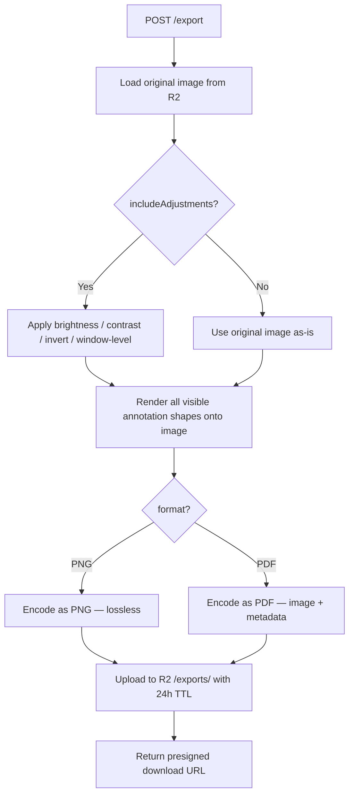

# X‑Ray Annotation Spec — Part 5: API & Export

> **Series**: [Upload & Storage](./xray-annotation-spec-part1-upload.md) · [Canvas Engine](./xray-annotation-spec-part2-canvas.md) · [Drawing Tools](./xray-annotation-spec-part3-tools.md) · [Measurements](./xray-annotation-spec-part4-measurements.md) · [API & Export]

---

## Overview

This part covers all **REST API endpoints** for the X‑ray annotation module, the **export pipeline** (PNG/PDF), **comparison view**, **error states**, and a consolidated **keyboard shortcuts reference**.

---

## API Endpoints

### X‑Ray Upload

```
POST   /api/xrays/upload-url
       Auth: required (clinic member)
       Body: {
         patientId: string,      // required
         fileName: string,       // original file name
         fileSize: number,       // bytes
         mimeType: string        // "image/jpeg" | "image/png"
       }
       Validations:
         - patientId belongs to user's clinic
         - fileSize ≤ 300 MB (314,572,800 bytes)
         - mimeType in allowed list
       Returns: {
         xrayId: string,
         uploadUrl: string,          // presigned R2 PUT URL (5 min expiry)
         thumbnailUploadUrl: string  // presigned R2 PUT URL for thumbnail
       }
       Status: 201 Created

POST   /api/xrays/{xrayId}/confirm
       Auth: required (must be uploader)
       Body: {
         width: number,    // px — from client‑side image dimension read
         height: number    // px
       }
       Validations:
         - width & height ≥ 100 and ≤ 16384
         - xray.status === UPLOADING
       Side effects:
         - Sets status → READY
         - Sets width, height
         - If clinic has default calibration → auto‑applies CLINIC_DEFAULT
       Returns: { xray: XrayObject }
       Status: 200 OK
```

### X‑Ray CRUD

```
GET    /api/xrays?patientId={id}&page={n}&limit={n}&status={status}
       Auth: required (clinic member with access to patient)
       Query params:
         - patientId: required
         - page: default 1
         - limit: default 20, max 100
         - status: optional filter ("READY" | "ARCHIVED"), default "READY"
       Returns: {
         xrays: XrayObject[],   // includes thumbnailUrl, excludes annotations
         total: number,
         page: number,
         limit: number
       }

GET    /api/xrays/{xrayId}
       Auth: required (clinic member)
       Returns: {
         xray: XrayObject,
         annotations: AnnotationSummary[]  // id, label, version, thumbnailUrl, createdAt — no canvasState
       }

PATCH  /api/xrays/{xrayId}
       Auth: required (clinic member with DOCTOR or OWNER role)
       Body: {
         title?: string,
         bodyRegion?: BodyRegion,
         viewType?: ViewType
       }
       Returns: { xray: XrayObject }

DELETE /api/xrays/{xrayId}
       Auth: required (OWNER or uploader)
       Behavior: soft‑delete (status → ARCHIVED)
       Returns: { success: true }
```

### X‑Ray Calibration

```
POST   /api/xrays/{xrayId}/calibrate
       Auth: required (DOCTOR or OWNER)
       Body: {
         pixelDistance: number,        // measured pixel distance from calibration line
         knownDistanceMm: number,     // real‑world distance in mm
         method: CalibrationMethod    // "REFERENCE_MARKER" | "MANUAL"
       }
       Side effects:
         - Computes pixelSpacing = knownDistanceMm / pixelDistance
         - Updates Xray: isCalibrated = true, pixelSpacing, calibrationMethod
       Returns: { xray: XrayObject }

DELETE /api/xrays/{xrayId}/calibrate
       Auth: required (DOCTOR or OWNER)
       Side effects:
         - Resets: isCalibrated = false, pixelSpacing = null, calibrationMethod = null
       Returns: { xray: XrayObject }
```

### Annotations

```
GET    /api/xrays/{xrayId}/annotations
       Auth: required (clinic member)
       Returns: {
         annotations: AnnotationSummary[]  // id, label, version, thumbnailUrl, createdAt, createdById
       }

GET    /api/xrays/{xrayId}/annotations/{annotationId}
       Auth: required (clinic member)
       Returns: {
         annotation: AnnotationObject  // includes full canvasState & imageAdjustments
       }

POST   /api/xrays/{xrayId}/annotations
       Auth: required (DOCTOR or OWNER)
       Body: {
         label?: string,
         canvasState: AnnotationCanvasState,   // see Part 2
         imageAdjustments?: ImageAdjustments   // see Part 2
       }
       Validations:
         - JSON.stringify(canvasState).length ≤ 10 MB (10,485,760 bytes)
         - xray.status === READY
       Side effects:
         - Sets version = 1
         - Computes canvasStateSize
         - Generates thumbnail (async — updates thumbnailUrl)
       Returns: { annotation: AnnotationObject }
       Status: 201 Created

PUT    /api/xrays/{xrayId}/annotations/{annotationId}
       Auth: required (creator or OWNER)
       Body: {
         label?: string,
         canvasState: AnnotationCanvasState,
         imageAdjustments?: ImageAdjustments
       }
       Validations:
         - JSON.stringify(canvasState).length ≤ 10 MB
       Side effects:
         - Increments version
         - Recomputes canvasStateSize
         - Regenerates thumbnail (async)
       Returns: { annotation: AnnotationObject }

POST   /api/xrays/{xrayId}/annotations/{annotationId}/fork
       Auth: required (DOCTOR or OWNER)
       Behavior:
         - Creates a new Annotation with canvasState copied from source
         - New id, version = 1, new createdById = current user
         - Label = "{source.label} (copy)" or "Annotation (copy)"
       Returns: { annotation: AnnotationObject }
       Status: 201 Created

DELETE /api/xrays/{xrayId}/annotations/{annotationId}
       Auth: required (creator or OWNER)
       Behavior: hard‑delete (permanently removed)
       Returns: { success: true }
```

---

## Export

### Export Endpoint

```
POST   /api/xrays/{xrayId}/annotations/{annotationId}/export
       Auth: required (clinic member)
       Body: {
         format: "png" | "pdf",
         includeAdjustments: boolean,  // apply brightness/contrast/invert to output
         dpi?: number                  // for PDF, default 150
       }
       Returns: {
         downloadUrl: string,   // presigned R2 URL (24h expiry)
         expiresAt: string,     // ISO 8601
         fileName: string,      // e.g. "xray-cervical-ap-annotated.png"
         fileSize: number       // bytes
       }
```

### Export Pipeline



### PDF Export Details

- Page size: auto‑fit image dimensions (no standard paper size forced)
- Header: patient name, X‑ray title, date, clinic name
- Footer: "Generated by SmartChiro" + export timestamp
- Measurement summary table appended on second page (if measurements exist)
- DPI: configurable (default 150, max 300)

### PNG Export Details

- Output dimensions: original image dimensions (full resolution)
- All visible annotation shapes rasterized onto image
- Transparency: none (solid canvas background behind image)

### Export Storage

```
/xrays/{clinicId}/{patientId}/{xrayId}/exports/{exportId}.{png|pdf}
```

- Exports auto‑expire after 24 hours (R2 lifecycle rule)
- Re‑exporting generates a new file (no caching of exports)

---

## Comparison View

### Endpoint

```
GET    /api/xrays/compare?ids={xrayId1},{xrayId2}
       Auth: required (clinic member, both xrays must belong to same patient)
       Validations:
         - Exactly 2 IDs provided
         - Both X‑rays belong to same patient
         - Both X‑rays have status READY
       Returns: {
         xrays: [XrayObject, XrayObject],
         annotations: {
           [xrayId1]: AnnotationSummary[],
           [xrayId2]: AnnotationSummary[]
         }
       }
```

### Client‑Side Behavior

- Two canvas instances rendered side by side (50/50 split, draggable divider)
- **Linked pan/zoom** (default on): pan/zoom in one canvas mirrors to the other
- Toggle: linked vs independent navigation
- Each canvas loads its own annotations independently
- Header shows: X‑ray title + date for each side
- Useful for: pre/post treatment comparison, temporal progression

---

## Error States (All Endpoints)

### Upload Errors (Part 1 recap)

| Error | HTTP | Response |
| --- | --- | --- |
| File too large | 400 | `{ error: "FILE_TOO_LARGE", message: "Maximum file size is 300 MB." }` |
| Invalid MIME type | 400 | `{ error: "INVALID_FILE_TYPE", message: "Only JPEG and PNG files are supported." }` |
| Invalid dimensions | 400 | `{ error: "INVALID_DIMENSIONS", message: "Image must be between 100×100 and 16384×16384 pixels." }` |
| Presigned URL expired | 410 | `{ error: "URL_EXPIRED", message: "Upload URL has expired. Request a new one." }` |

### Annotation Errors

| Error | HTTP | Response |
| --- | --- | --- |
| Canvas state too large | 400 | `{ error: "CANVAS_STATE_TOO_LARGE", message: "Annotation data exceeds 10 MB limit." }` |
| Xray not ready | 400 | `{ error: "XRAY_NOT_READY", message: "X‑ray upload has not been confirmed." }` |
| Annotation not found | 404 | `{ error: "NOT_FOUND", message: "Annotation not found." }` |
| Unauthorized | 403 | `{ error: "FORBIDDEN", message: "You don't have permission to modify this annotation." }` |

### Export Errors

| Error | HTTP | Response |
| --- | --- | --- |
| Export failed (server) | 500 | `{ error: "EXPORT_FAILED", message: "Export failed. Please try again." }` |
| Invalid format | 400 | `{ error: "INVALID_FORMAT", message: "Supported formats: png, pdf." }` |

### Client‑Side Error UX

| Scenario | UX |
| --- | --- |
| Save failed (network) | Status bar: "Save failed — retrying..." → auto‑retry 3× with exponential backoff → "Unable to save. Check your connection." + manual retry button |
| Export failed | Toast: "Export failed. Please try again." |
| Canvas state approaching 10 MB | Toast warning at 5 MB: "Annotation file is getting large. Consider simplifying some shapes." |
| Canvas state exceeds 10 MB | Toast: "Annotation data is too large. Try simplifying some shapes." — block save |

---

## Response Object Schemas

### XrayObject

```typescript
interface XrayObject {
  id: string;
  title: string | null;
  bodyRegion: BodyRegion | null;
  viewType: ViewType | null;
  status: XrayStatus;
  fileUrl: string;
  fileName: string;
  fileSize: number;
  mimeType: string;
  width: number;
  height: number;
  thumbnailUrl: string | null;
  isCalibrated: boolean;
  pixelSpacing: number | null;
  calibrationMethod: CalibrationMethod | null;
  patientId: string;
  visitId: string | null;
  uploadedById: string;
  createdAt: string;       // ISO 8601
  updatedAt: string;
}
```

### AnnotationSummary

```typescript
interface AnnotationSummary {
  id: string;
  label: string | null;
  version: number;
  thumbnailUrl: string | null;
  canvasStateSize: number;     // bytes
  createdById: string;
  createdAt: string;
  updatedAt: string;
}
```

### AnnotationObject

```typescript
interface AnnotationObject extends AnnotationSummary {
  canvasState: AnnotationCanvasState;   // full canvas state — see Part 2
  imageAdjustments: ImageAdjustments | null;
  xrayId: string;
}
```

---

## Complete Keyboard Shortcuts Reference

### Global

| Shortcut | Action |
| --- | --- |
| `Ctrl/Cmd + Z` | Undo |
| `Ctrl/Cmd + Shift + Z` | Redo |
| `Ctrl/Cmd + S` | Save annotation |
| `Ctrl/Cmd + Shift + E` | Export annotated image |
| `Ctrl/Cmd + A` | Select all shapes |
| `Delete` / `Backspace` | Delete selected shape(s) |
| `Escape` | Deselect / cancel current action / exit tool |
| `Ctrl/Cmd + D` | Duplicate selected shape(s) |
| `[` | Send selected shape backward |
| `]` | Bring selected shape forward |
| `\` | Toggle properties panel |

### Tool Selection

| Shortcut | Tool |
| --- | --- |
| `V` | Select / Move |
| `P` | Freehand Pen |
| `L` | Line |
| `Shift + L` | Polyline |
| `A` | Arrow |
| `R` | Rectangle |
| `E` | Ellipse |
| `B` | Bezier Curve |
| `T` | Text |
| `M` | Ruler (measurement) |
| `Shift + M` | Angle measurement |
| `Ctrl/Cmd + Shift + M` | Cobb Angle measurement |
| `H` | Pan / Hand tool |
| `K` | Calibration tool |
| `X` | Eraser |

### Navigation

| Shortcut | Action |
| --- | --- |
| `Space + drag` | Temporary pan |
| `Scroll wheel` | Zoom in/out (centered on cursor) |
| `Ctrl/Cmd + 0` | Fit image to viewport |
| `Ctrl/Cmd + 1` | Zoom to 100% |
| `Ctrl/Cmd + +` | Zoom in |
| `Ctrl/Cmd + -` | Zoom out |

### Drawing Modifiers

| Modifier | Effect |
| --- | --- |
| `Shift` | Constrain angles (line/arrow/ruler) or aspect ratio (rect/ellipse) |
| `Alt / Option` | Draw from center (rect/ellipse) |
| `Shift + Alt` | Constrain + draw from center |

---

## Spec Status & Index

| Part | File | Status |
| --- | --- | --- |
| 1 — Upload & Storage | `xray-annotation-spec-part1-upload.md` | ✅ Complete |
| 2 — Canvas Engine | `xray-annotation-spec-part2-canvas.md` | ✅ Complete |
| 3 — Drawing Tools | `xray-annotation-spec-part3-tools.md` | ✅ Complete |
| 4 — Measurements | `xray-annotation-spec-part4-measurements.md` | ✅ Complete |
| 5 — API & Export | `xray-annotation-spec-part5-api.md` | ✅ Complete |
| AI Analysis | (separate spec — TBD) | ⏳ Pending |

### Key Decisions

- Canvas library: **TBD** (Konva.js / Fabric.js / custom)
- All shape schemas are library‑agnostic
- AI analysis deferred to separate spec
- Manual annotation tools only in this spec series

---

🦴 **SmartChiro X‑Ray Annotation — Part 5 of 5**
