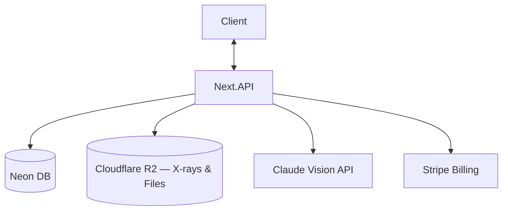
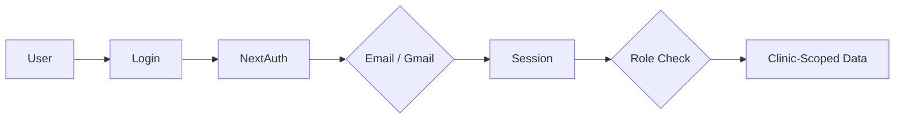
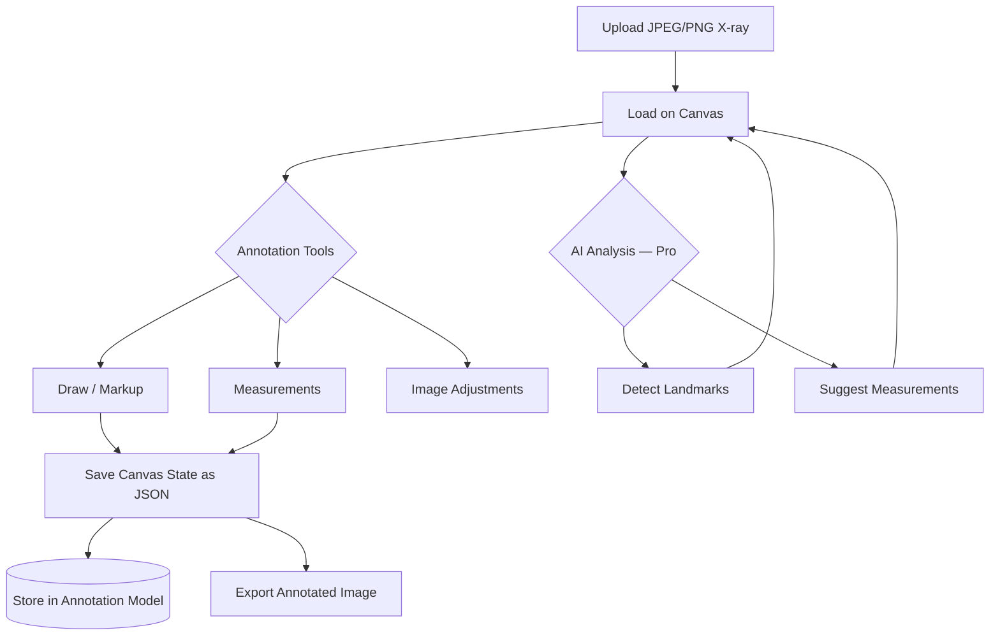
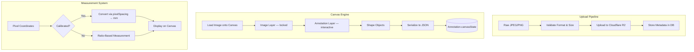

# SmartChiro Project Specifications

🦴 Chiropractic Patient Management & Digital X‑Ray Annotation Platform

---

## SmartChiro Project Specifications

🦴 **SmartChiro** — A modern patient management system purpose‑built for chiropractors, with **Adobe‑grade annotation tools** for digital X‑ray analysis directly in the browser.

> Evolved from the **Gonstead Digital Suite** prototype. SmartChiro broadens the scope from X‑ray‑only tooling into a full clinic management platform while keeping the canvas‑based radiograph analysis as the hero feature.

---

## 📌 Problem (Core Idea)

Chiropractors juggle disconnected tools daily:

- Patient records in paper files or generic EMR systems
- X‑rays viewed in clunky DICOM viewers or printed on film
- Annotations done by hand with rulers and markers on lightboxes
- Measurements scribbled on paper, not stored digitally
- Appointment scheduling on separate calendar apps
- Treatment notes typed into Word docs or Google Forms
- Billing and invoicing handled manually or through unrelated software

This creates **fragmented workflows, lost clinical data** and **no visual treatment progress tracking**.

➡️ **SmartChiro provides ONE integrated platform where chiropractors manage patients, annotate X‑rays with precision drawing tools, and track treatment outcomes — all in the browser.**

---

## 🧑‍💻 Users

| Persona | Needs |
| --- | --- |
| Solo Practitioner | All‑in‑one patient records, imaging, scheduling |
| Clinic Owner (Multi‑Doctor) | Staff management, shared patient records, clinic‑wide analytics |
| Associate Chiropractor | Quick access to assigned patients, annotation tools |
| Clinic Admin / Front Desk | Appointment scheduling, patient intake, billing |
| Chiropractic Student | Learning tool for X‑ray analysis and Gonstead technique |

---

## ✨ Core Features

### A) Patient Management

- Patient profiles (demographics, contact, medical history)
- Treatment plans & visit logs
- SOAP notes (Subjective, Objective, Assessment, Plan)
- Document attachments per patient
- Patient search & filtering

### B) Digital X‑Ray Annotation (⭐ Hero Feature)

Upload JPEG/PNG X‑ray images and annotate directly on canvas with Adobe AI‑grade tools:

**Drawing & Markup Tools:**

- Freehand pen / pencil
- Straight lines & polylines
- Rectangles, circles, ellipses
- Arrows & connectors
- Text labels & callouts
- Bezier curve tool

**Measurement Tools:**

- Ruler tool (distance measurement)
- Angle measurement (Cobb angle, Ferguson's angle, etc.)
- Ratio measurement (George's line, etc.)
- Dual‑mode: ratio‑based (default) or calibrated mm via clinic profiles

**Canvas Controls:**

- Pan & zoom (pinch‑to‑zoom on touch)
- Undo / redo (full history stack)
- Layer management (annotations vs image)
- Adjustable stroke color, width, opacity
- Shape selection, move, resize, rotate, delete
- Snap‑to guides & alignment helpers
- Keyboard shortcuts

**Image Adjustments:**

- Brightness / contrast
- Invert (negative)
- Window / level controls
- Zoom to region of interest

**AI‑Powered Analysis (Pro):**

- Landmark detection (Claude Vision API)
- Auto‑measurement suggestions
- Comparative analysis (pre/post overlay)

**Export & Sharing:**

- Export annotated image as PNG/PDF
- Save annotation state (JSON) for re‑editing
- Side‑by‑side comparison view (before/after)
- Print‑ready report generation with annotations embedded

### C) Appointments & Scheduling

- Calendar view (day / week / month)
- Appointment booking with patient linking
- Status tracking (scheduled, checked‑in, completed, no‑show)
- Recurring appointment support
- Whatsapp / email reminders (future phase)

### D) Clinic Management

- Multi‑clinic support (one account, multiple locations)
- Staff roles & permissions (Owner, Doctor, Admin, Viewer)
- Clinic profiles with calibration settings for X‑ray measurements
- Activity logs & audit trail

### E) Billing & Invoicing

- Invoice generation per visit / treatment plan
- Payment status tracking
- Basic financial reporting
- Receipt generation (PDF)
- Malaysian e‑invoicing compliance (LHDN MyInvois — future phase)

### F) Authentication & Access Control

- Email + password
- Gmail / Google OAuth
- Role‑based access control (RBAC)
- Clinic‑scoped data isolation

### G) Additional Features

- Dashboard with clinic overview (today's appointments, recent patients, stats)
- Full‑text search across patients, notes, annotations
- Data export (JSON / CSV / ZIP)
- Dark mode support (optional toggle, light mode default)
- Mobile responsive (annotation tools optimized for tablet)
- File uploads (X‑rays, documents, photos)

---

## 🗄️ Data Model (Rough Prisma Draft)

> This schema is a starting point and **will evolve**

```prisma
// ─── Auth & Organization ───

model User {
  id                   String   @id @default(cuid())
  email                String   @unique
  name                 String?
  password             String?
  image                String?

  role                 GlobalRole @default(USER)

  clinicMemberships    ClinicMember[]
  createdAt            DateTime @default(now())
  updatedAt            DateTime @updatedAt
}

enum GlobalRole {
  USER
  ADMIN
}

model Clinic {
  id                   String   @id @default(cuid())
  name                 String
  address              String?
  phone                String?
  email                String?
  logo                 String?

  // X‑ray calibration defaults
  calibrationEnabled   Boolean  @default(false)
  defaultPixelSpacing  Float?   // mm per pixel when calibrated

  members              ClinicMember[]
  patients             Patient[]
  appointments         Appointment[]
  invoices             Invoice[]

  createdAt            DateTime @default(now())
  updatedAt            DateTime @updatedAt
}

model ClinicMember {
  id                   String     @id @default(cuid())
  role                 ClinicRole @default(DOCTOR)

  userId               String
  user                 User       @relation(fields: [userId], references: [id])

  clinicId             String
  clinic               Clinic     @relation(fields: [clinicId], references: [id])

  createdAt            DateTime   @default(now())

  @@unique([userId, clinicId])
}

enum ClinicRole {
  OWNER
  DOCTOR
  ADMIN
  VIEWER
}

// ─── Patient & Clinical ───

model Patient {
  id                   String   @id @default(cuid())
  firstName            String
  lastName             String
  email                String?
  phone                String?
  dateOfBirth          DateTime?
  gender               String?
  address              String?
  emergencyContact     String?
  medicalHistory       String?  // rich text / markdown
  notes                String?

  clinicId             String
  clinic               Clinic   @relation(fields: [clinicId], references: [id])

  visits               Visit[]
  xrays                Xray[]
  appointments         Appointment[]
  invoices             Invoice[]
  documents            PatientDocument[]

  createdAt            DateTime @default(now())
  updatedAt            DateTime @updatedAt
}

model Visit {
  id                   String   @id @default(cuid())
  visitDate            DateTime @default(now())

  // SOAP Notes
  subjective           String?
  objective            String?
  assessment           String?
  plan                 String?

  treatmentNotes       String?

  patientId            String
  patient              Patient  @relation(fields: [patientId], references: [id])

  doctorId             String   // references User.id
  appointmentId        String?  @unique

  xrays                Xray[]

  createdAt            DateTime @default(now())
  updatedAt            DateTime @updatedAt
}

// ─── X‑Ray & Annotations (⭐ Core) ───

model Xray {
  id                   String   @id @default(cuid())
  title                String?
  bodyRegion           String?  // cervical, thoracic, lumbar, pelvis, full‑spine
  viewType             String?  // AP, lateral, oblique

  // Original upload
  fileUrl              String
  fileName             String
  fileSize             Int
  mimeType             String   // image/jpeg, image/png
  width                Int?     // original image dimensions
  height               Int?

  // Calibration
  isCalibrated         Boolean  @default(false)
  pixelSpacing         Float?   // mm per pixel

  patientId            String
  patient              Patient  @relation(fields: [patientId], references: [id])

  visitId              String?
  visit                Visit?   @relation(fields: [visitId], references: [id])

  annotations          Annotation[]

  createdAt            DateTime @default(now())
  updatedAt            DateTime @updatedAt
}

model Annotation {
  id                   String   @id @default(cuid())
  label                String?
  version              Int      @default(1)

  // Full canvas state stored as JSON
  canvasState          Json     // array of shape objects from canvas library
  thumbnail            String?  // auto‑generated preview URL

  // AI analysis results
  aiLandmarks          Json?
  aiMeasurements       Json?

  xrayId               String
  xray                 Xray     @relation(fields: [xrayId], references: [id])

  createdById          String   // references User.id

  createdAt            DateTime @default(now())
  updatedAt            DateTime @updatedAt
}

// ─── Appointments ───

model Appointment {
  id                   String            @id @default(cuid())
  dateTime             DateTime
  duration             Int               @default(30) // minutes
  status               AppointmentStatus @default(SCHEDULED)
  notes                String?

  patientId            String
  patient              Patient  @relation(fields: [patientId], references: [id])

  clinicId             String
  clinic               Clinic   @relation(fields: [clinicId], references: [id])

  doctorId             String   // references User.id

  visit                Visit?

  createdAt            DateTime @default(now())
  updatedAt            DateTime @updatedAt
}

enum AppointmentStatus {
  SCHEDULED
  CHECKED_IN
  IN_PROGRESS
  COMPLETED
  CANCELLED
  NO_SHOW
}

// ─── Billing ───

model Invoice {
  id                   String        @id @default(cuid())
  invoiceNumber        String        @unique
  amount               Decimal
  currency             String        @default("MYR")
  status               InvoiceStatus @default(DRAFT)
  dueDate              DateTime?
  paidAt               DateTime?
  notes                String?
  lineItems            Json          // array of { description, quantity, unitPrice, total }

  patientId            String
  patient              Patient  @relation(fields: [patientId], references: [id])

  clinicId             String
  clinic               Clinic   @relation(fields: [clinicId], references: [id])

  createdAt            DateTime @default(now())
  updatedAt            DateTime @updatedAt
}

enum InvoiceStatus {
  DRAFT
  SENT
  PAID
  OVERDUE
  CANCELLED
}

// ─── Documents ───

model PatientDocument {
  id                   String   @id @default(cuid())
  title                String
  fileUrl              String
  fileName             String
  fileSize             Int
  mimeType             String
  category             String?  // consent, referral, insurance, lab‑result, other

  patientId            String
  patient              Patient  @relation(fields: [patientId], references: [id])

  uploadedById         String   // references User.id

  createdAt            DateTime @default(now())
}
```

---

## 🧱 Tech Stack

| Category | Choice |
| --- | --- |
| Framework | **Next.js 16 (React 19)** |
| Language | TypeScript |
| Database | Neon PostgreSQL + Prisma 7 |
| File Storage | Cloudflare R2 |
| CSS / UI | Tailwind CSS v4 + shadcn/ui |
| Auth | NextAuth v5 (email + Gmail/Google) |
| Canvas Library | **TBD** (evaluating Konva.js, Fabric.js, or custom) |
| AI | Claude Vision API (landmark detection & analysis) |
| Deployment | Vercel |
| Monitoring | Sentry (later) |
| PDF Generation | React‑PDF or Puppeteer |

---

## 💰 Monetization

| Plan | Price | Details |
| --- | --- | --- |
| Free Trial | RM 0 (30 days) | Full access to all features for 30 days — no credit card required. After trial expires, account becomes read‑only until upgraded. |
| Pro | RM 399/mo | Unlimited doctors, patients, X‑rays, AI analysis, landmark detection, comparative overlays, multi‑clinic, full annotation suite, SOAP notes, scheduling, invoicing, export, priority support |

> Stripe for subscriptions + webhooks for plan syncing
> All prices in MYR
> Trial‑to‑paid conversion flow: in‑app banner countdown → upgrade prompt → read‑only lock after 30 days

---

## 🎨 UI / UX — Stripe‑Inspired Design System

Design language modeled after the **Stripe Dashboard** — clean, professional, light‑background interface with accessible color contrast. All font sizes are 15% larger than Stripe's defaults for improved readability in a clinical setting.

### Design Tokens

**Typography:**

```css
--font-family: "Helvetica Neue", -apple-system, BlinkMacSystemFont,
               "Segoe UI", Roboto, Arial, sans-serif;
--font-mono: "SF Mono", "Fira Code", "Fira Mono", Menlo, Consolas, monospace;

/* Base sizes (Stripe defaults + 15% bump) */
--font-size-xs:    14px;   /* Stripe 12px → 14px — badges, tooltips */
--font-size-sm:    15px;   /* Stripe 13px → 15px — nav items, labels, secondary text */
--font-size-base:  16px;   /* Stripe 14px → 16px — body default */
--font-size-md:    18px;   /* Stripe 16px → 18px */
--font-size-lg:    23px;   /* Stripe 20px → 23px — page headings */
--font-size-xl:    28px;   /* Stripe 24px → 28px */
--font-size-2xl:   34px;   /* Stripe 30px → 34px */

--font-weight-normal:   400;
--font-weight-medium:   500;   /* Primary for UI labels */
--font-weight-semibold: 600;
--font-weight-bold:     700;

--line-height-tight:  1.2;
--line-height-normal: 1.5;
--line-height-relaxed: 1.625;
```

**Color Palette:**

```css
/* ─── Brand ─── */
--color-primary:        #635BFF;  /* Stripe Indigo — buttons, active states, links */
--color-primary-hover:  #5851EB;
--color-primary-light:  #F0EEFF;  /* Indigo tint for selected row / active bg */

/* ─── Backgrounds ─── */
--color-bg-page:        #F6F9FC;  /* Main page background (light gray‑blue) */
--color-bg-surface:     #FFFFFF;  /* Cards, panels, modals, sidebar, top bar */
--color-bg-hover:       #F0F3F7;  /* Row / item hover state */
--color-bg-selected:    #F0EEFF;  /* Selected / active item */

/* ─── Text ─── */
--color-text-primary:   #0A2540;  /* Headings, primary labels */
--color-text-secondary: #425466;  /* Body text, descriptions, inactive nav */
--color-text-muted:     #697386;  /* Placeholder, hints, timestamps */
--color-text-disabled:  #A3ACB9;

/* ─── Borders ─── */
--color-border:         #E3E8EE;  /* Default border (subtle gray) */
--color-border-hover:   #C1C9D2;
--color-border-focus:   #635BFF;  /* Focus ring uses primary */

/* ─── Semantic ─── */
--color-success:        #30B130;  /* Paid, completed, active */
--color-warning:        #F5A623;  /* Pending, overdue */
--color-danger:         #DF1B41;  /* Error, cancelled, destructive */
--color-info:           #0570DE;  /* Informational badges */
```

**Spacing & Radius:**

```css
/* Stripe uses tight 4px radius — NOT rounded-lg (8px) */
--radius-sm:   4px;    /* Inputs, buttons, nav items, hover targets */
--radius-md:   6px;    /* Cards, dropdowns */
--radius-lg:   8px;    /* Modals, panels */
--radius-full: 9999px; /* Pill badges, avatars */

--spacing-xs:  4px;
--spacing-sm:  8px;
--spacing-md:  12px;
--spacing-lg:  16px;
--spacing-xl:  24px;
--spacing-2xl: 32px;
--spacing-3xl: 48px;
```

**Shadows (Stripe‑grade — ultra‑subtle with blue‑gray tint):**

```css
--shadow-xs:   0 1px 1px rgba(0, 0, 0, 0.03), 0 1px 2px rgba(0, 0, 0, 0.02);
--shadow-sm:   0 1px 1px rgba(0, 0, 0, 0.03), 0 3px 6px rgba(18, 42, 66, 0.02);
--shadow-card: 0 0 0 1px rgba(0, 0, 0, 0.04), 0 1px 1px rgba(0, 0, 0, 0.03), 0 3px 6px rgba(18, 42, 66, 0.02);
--shadow-md:   0 2px 4px rgba(0, 0, 0, 0.04), 0 4px 12px rgba(18, 42, 66, 0.04);
--shadow-lg:   0 4px 6px rgba(0, 0, 0, 0.04), 0 8px 24px rgba(18, 42, 66, 0.06);
```

### Design Principles

- **Light mode first** — white surfaces (`#FFFFFF`) on `#F6F9FC` page background
- **Readable density** — 16px base font (15% bump from Stripe's 14px), compact rows, efficient use of space
- **Subtle depth** — borders + faint blue‑gray tinted shadows (`rgba(18, 42, 66, ...)`) over bold drop shadows
- **Tight radius** — 4px border‑radius on buttons, inputs, nav items (not rounded‑lg)
- **Accessible contrast** — all text colors pass WCAG 2.0 AA on their respective backgrounds
- **Consistent iconography** — Lucide icons (matches shadcn/ui defaults), 16px size, strokeWidth 1.5 (2 for active)
- **Muted color usage** — semantic colors for status only, never decorative
- **Explicit colors** — use hardcoded hex values (`#0A2540`, `#425466`, `#697386`, `#F0F3F7`) in components, not abstract CSS variable names, for precision control

### Layout

- **Collapsible sidebar** (220px expanded / 68px collapsed, white bg, `border-r border-[#E3E8EE]`): nav items with icons, clinic branding at top with `border-b`, profile/logout at bottom
- **Top bar** (52px height, white bg, `border-b`): search input with `#F6F9FC` background, center nav tabs, notification bell, user avatar
- **Main workspace** (`px-8 py-6`): patient detail, visit timeline, or annotation canvas
- **Full‑screen annotation mode**: canvas takes over viewport with floating toolbars (dark bg for contrast with X‑ray images)
- **Split view**: side‑by‑side X‑ray comparison

### Annotation Canvas UX

- Floating toolbar (left): drawing tools, shapes, measurement tools
- Top bar: image adjustments (brightness, contrast, invert)
- Right panel (collapsible): layers, annotation list, measurements summary
- Bottom bar: zoom controls, fit‑to‑screen, grid toggle
- **Exception: annotation canvas uses dark background** (`#1A1F36`) for optimal X‑ray contrast

### Component Patterns (Stripe‑Style)

- **Tables**: white rows, no zebra stripes, hover with `#F0F3F7`, thin `#E3E8EE` horizontal separators
- **Cards**: white bg, 1px border `#E3E8EE`, `rounded-[6px]`, `--shadow-card`
- **Buttons**: `rounded-[4px]`; primary = solid `#635BFF` + white text; secondary = white bg + `#E3E8EE` border; ghost = no bg/border
- **Inputs**: 1px border `#E3E8EE`, `rounded-[4px]`, 32px height, bg `#F6F9FC`, focus ring `#635BFF` with `ring-1`
- **Badges/Pills**: `rounded-full`, tinted bg with matching text (e.g., success: green bg + green text)
- **Sidebar nav items**: text + icon, `rounded-[4px]`, 6px vertical padding, active = `#F0EEFF` bg + `#635BFF` text, inactive = `#425466` text, hover = `#F0F3F7` bg + `#0A2540` text
- **Avatar fallback**: `rounded-full`, `#F0EEFF` bg + `#635BFF` text

### Responsive

- Desktop‑first (primary use case is clinic workstations)
- Tablet‑optimized for annotation (stylus support)
- Mobile: patient lookup, schedule view, visit notes (no annotation on mobile)

---

## 🔌 API Architecture



---

## 🔐 Auth Flow



---

## 🖼️ Annotation Feature Flow



---

## 🩻 X‑Ray Annotation Technical Architecture



---

## 📐 Measurement Specifications

| Measurement | Type | Use Case |
| --- | --- | --- |
| George's Line | Ratio | Cervical vertebral body alignment |
| Cobb Angle | Angle | Scoliosis curvature assessment |
| Ferguson's Angle | Angle | Lumbosacral angle measurement |
| Atlas Laterality | Distance | C1 lateral displacement |
| Disc Space Height | Distance | Intervertebral disc evaluation |
| Cervical Curve Arc | Arc / Angle | Lordosis assessment |
| Custom | Any | User‑defined measurements |

**Calibration**: Clinic profiles store a default `pixelSpacing` (mm/px). Users can override per X‑ray using a known reference marker (e.g., coin or ruler in image).

---

## 🗂️ Development Workflow

- **One branch per feature** — clean PRs, easy to track
- Built with **Claude Code / Cursor** for AI‑assisted development
- Sentry for runtime monitoring (post‑MVP)
- GitHub Actions for CI (linting, type‑check, tests)

**Branch examples:**

```
git switch -c feat/patient-crud
git switch -c feat/xray-upload
git switch -c feat/annotation-canvas
git switch -c feat/measurement-tools
git switch -c feat/appointment-calendar
```

---

## 🧭 Roadmap

### **Phase 1 — MVP**

- Auth (email + Gmail, clinic setup)
- Patient CRUD + search
- X‑ray upload to R2
- Basic annotation canvas (pen, lines, shapes, text)
- Ruler & angle measurement (ratio mode)
- SOAP notes per visit
- Dashboard overview
- Stripe‑inspired light UI theme

### **Phase 2 — Clinical**

- Full measurement suite (Cobb angle, George's line, etc.)
- Calibrated mode (mm measurements via clinic profiles)
- Appointment scheduling & calendar
- Side‑by‑side X‑ray comparison
- Annotation versioning (save multiple states per X‑ray)
- Export annotated images as PDF reports

### **Phase 3 — Pro / AI**

- AI landmark detection (Claude Vision API)
- Auto‑measurement suggestions
- Pre/post treatment overlay comparison
- Invoice generation & payment tracking
- Multi‑clinic support
- Role‑based permissions (Owner, Doctor, Admin, Viewer)

### **Phase 4 — Scale**

- Malaysian e‑invoicing compliance (LHDN MyInvois)
- SMS / email appointment reminders
- Patient portal (view own records)
- DICOM import support (premium tier)
- Mobile app (React Native — tablet‑first for annotation)
- API for third‑party integrations

---

## 🏗️ Migration from Gonstead Digital Suite

SmartChiro inherits and extends the Gonstead Digital Suite (v0.3):

| Gonstead Suite Feature | SmartChiro Evolution |
| --- | --- |
| Claude Vision landmark detection | Retained as Pro‑tier AI feature |
| Dual‑mode measurement (ratio + calibrated) | Retained, calibration now per‑clinic profile |
| Konva.js canvas | Canvas library **TBD** — evaluating alternatives |
| JPEG‑first, DICOM future | Same strategy: JPEG/PNG MVP, DICOM Phase 4 |
| Single‑user prototype | Multi‑user, multi‑clinic, RBAC |
| X‑ray analysis only | Full patient management + scheduling + billing |
| No persistence layer | Neon PostgreSQL + Prisma 7 + Cloudflare R2 |

---

## 📌 Status

- Specification complete
- Gonstead Digital Suite v0.3 prototype validated core canvas & AI features
- Ready for project scaffolding & Phase 1 development

---

🦴 **SmartChiro — See More. Treat Better.**