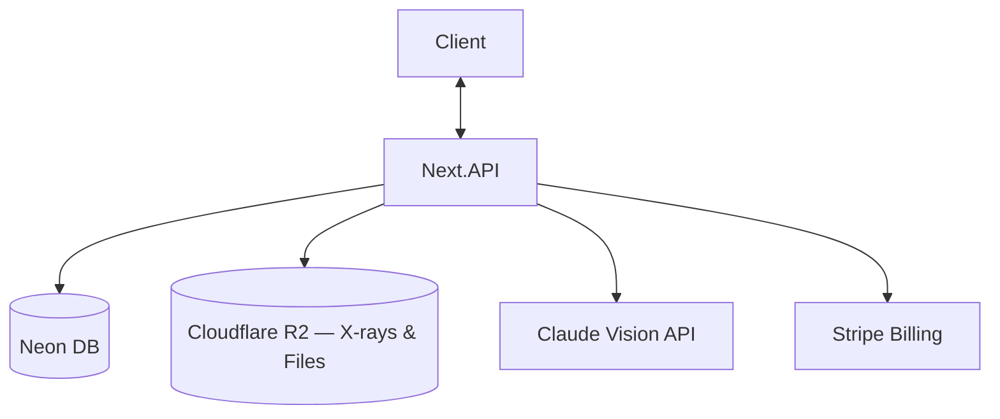
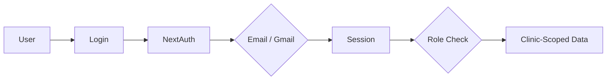
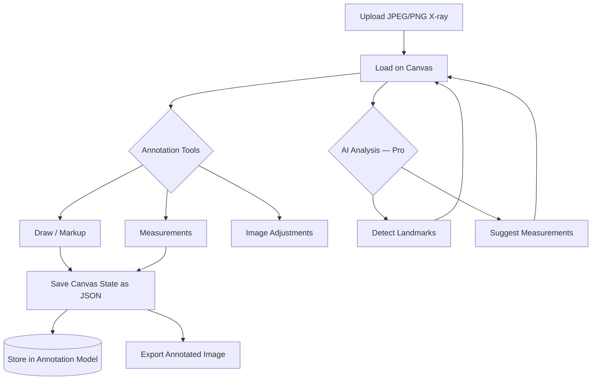
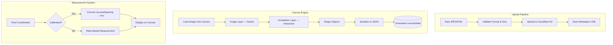

# SmartChiro Project Specifications

🦴 Chiropractic Patient Management & Digital X‑Ray Annotation Platform

---

## SmartChiro Project Specifications

🦴 **SmartChiro** — A modern patient management system purpose‑built for chiropractors, with **Adobe‑grade annotation tools** for digital X‑ray analysis directly in the browser.

> Evolved from the **Gonstead Digital Suite** prototype. SmartChiro broadens the scope from X‑ray‑only tooling into a full clinic management platform while keeping the canvas‑based radiograph analysis as the hero feature.

---

## 📌 Problem (Core Idea)

Chiropractors juggle disconnected tools daily:

- Patient records in paper files or generic EMR systems
- X‑rays viewed in clunky DICOM viewers or printed on film
- Annotations done by hand with rulers and markers on lightboxes
- Measurements scribbled on paper, not stored digitally
- Appointment scheduling on separate calendar apps
- Treatment notes typed into Word docs or Google Forms
- Billing and invoicing handled manually or through unrelated software

This creates **fragmented workflows, lost clinical data** and **no visual treatment progress tracking**.

➡️ **SmartChiro provides ONE integrated platform where chiropractors manage patients, annotate X‑rays with precision drawing tools, and track treatment outcomes — all in the browser.**

---

## 🧑‍💻 Users

| Persona | Needs |
| --- | --- |
| Solo Practitioner | All‑in‑one patient records, imaging, scheduling |
| Clinic Owner (Multi‑Doctor) | Staff management, shared patient records, clinic‑wide analytics |
| Associate Chiropractor | Quick access to assigned patients, annotation tools |
| Clinic Admin / Front Desk | Appointment scheduling, patient intake, billing |
| Chiropractic Student | Learning tool for X‑ray analysis and Gonstead technique |

---

## ✨ Core Features

### A) Patient Management

- Patient profiles (demographics, contact, medical history)
- Treatment plans & visit logs
- SOAP notes (Subjective, Objective, Assessment, Plan)
- Document attachments per patient
- Patient search & filtering

### B) Digital X‑Ray Annotation (⭐ Hero Feature)

Upload JPEG/PNG X‑ray images and annotate directly on canvas with Adobe AI‑grade tools:

**Drawing & Markup Tools:**

- Freehand pen / pencil
- Straight lines & polylines
- Rectangles, circles, ellipses
- Arrows & connectors
- Text labels & callouts
- Bezier curve tool

**Measurement Tools:**

- Ruler tool (distance measurement)
- Angle measurement (Cobb angle, Ferguson's angle, etc.)
- Ratio measurement (George's line, etc.)
- Dual‑mode: ratio‑based (default) or calibrated mm via clinic profiles

**Canvas Controls:**

- Pan & zoom (pinch‑to‑zoom on touch)
- Undo / redo (full history stack)
- Layer management (annotations vs image)
- Adjustable stroke color, width, opacity
- Shape selection, move, resize, rotate, delete
- Snap‑to guides & alignment helpers
- Keyboard shortcuts

**Image Adjustments:**

- Brightness / contrast
- Invert (negative)
- Window / level controls
- Zoom to region of interest

**AI‑Powered Analysis (Pro):**

- Landmark detection (Claude Vision API)
- Auto‑measurement suggestions
- Comparative analysis (pre/post overlay)

**Export & Sharing:**

- Export annotated image as PNG/PDF
- Save annotation state (JSON) for re‑editing
- Side‑by‑side comparison view (before/after)
- Print‑ready report generation with annotations embedded

### C) Appointments & Scheduling

- Calendar view (day / week / month)
- Appointment booking with patient linking
- Status tracking (scheduled, checked‑in, completed, no‑show)
- Recurring appointment support
- Whatsapp / email reminders (future phase)

### D) Clinic Management

- Multi‑clinic support (one account, multiple locations)
- Staff roles & permissions (Owner, Doctor, Admin, Viewer)
- Clinic profiles with calibration settings for X‑ray measurements
- Activity logs & audit trail

### E) Billing & Invoicing

- Invoice generation per visit / treatment plan
- Payment status tracking
- Basic financial reporting
- Receipt generation (PDF)
- Malaysian e‑invoicing compliance (LHDN MyInvois — future phase)

### F) Authentication & Access Control

- Email + password
- Gmail / Google OAuth
- Role‑based access control (RBAC)
- Clinic‑scoped data isolation

### G) Additional Features

- Dashboard with clinic overview (today's appointments, recent patients, stats)
- Full‑text search across patients, notes, annotations
- Data export (JSON / CSV / ZIP)
- Dark mode support (optional toggle, light mode default)
- Mobile responsive (annotation tools optimized for tablet)
- File uploads (X‑rays, documents, photos)

---

## 🗄️ Data Model (Rough Prisma Draft)

> This schema is a starting point and **will evolve**

```prisma
// ─── Auth & Organization ───

model User {
  id                   String   @id @default(cuid())
  email                String   @unique
  name                 String?
  password             String?
  image                String?

  role                 GlobalRole @default(USER)

  clinicMemberships    ClinicMember[]
  createdAt            DateTime @default(now())
  updatedAt            DateTime @updatedAt
}

enum GlobalRole {
  USER
  ADMIN
}

model Clinic {
  id                   String   @id @default(cuid())
  name                 String
  address              String?
  phone                String?
  email                String?
  logo                 String?

  // X‑ray calibration defaults
  calibrationEnabled   Boolean  @default(false)
  defaultPixelSpacing  Float?   // mm per pixel when calibrated

  members              ClinicMember[]
  patients             Patient[]
  appointments         Appointment[]
  invoices             Invoice[]

  createdAt            DateTime @default(now())
  updatedAt            DateTime @updatedAt
}

model ClinicMember {
  id                   String     @id @default(cuid())
  role                 ClinicRole @default(DOCTOR)

  userId               String
  user                 User       @relation(fields: [userId], references: [id])

  clinicId             String
  clinic               Clinic     @relation(fields: [clinicId], references: [id])

  createdAt            DateTime   @default(now())

  @@unique([userId, clinicId])
}

enum ClinicRole {
  OWNER
  DOCTOR
  ADMIN
  VIEWER
}

// ─── Patient & Clinical ───

model Patient {
  id                   String   @id @default(cuid())
  firstName            String
  lastName             String
  email                String?
  phone                String?
  dateOfBirth          DateTime?
  gender               String?
  address              String?
  emergencyContact     String?
  medicalHistory       String?  // rich text / markdown
  notes                String?

  clinicId             String
  clinic               Clinic   @relation(fields: [clinicId], references: [id])

  visits               Visit[]
  xrays                Xray[]
  appointments         Appointment[]
  invoices             Invoice[]
  documents            PatientDocument[]

  createdAt            DateTime @default(now())
  updatedAt            DateTime @updatedAt
}

model Visit {
  id                   String   @id @default(cuid())
  visitDate            DateTime @default(now())

  // SOAP Notes
  subjective           String?
  objective            String?
  assessment           String?
  plan                 String?

  treatmentNotes       String?

  patientId            String
  patient              Patient  @relation(fields: [patientId], references: [id])

  doctorId             String   // references User.id
  appointmentId        String?  @unique

  xrays                Xray[]

  createdAt            DateTime @default(now())
  updatedAt            DateTime @updatedAt
}

// ─── X‑Ray & Annotations (⭐ Core) ───

model Xray {
  id                   String   @id @default(cuid())
  title                String?
  bodyRegion           String?  // cervical, thoracic, lumbar, pelvis, full‑spine
  viewType             String?  // AP, lateral, oblique

  // Original upload
  fileUrl              String
  fileName             String
  fileSize             Int
  mimeType             String   // image/jpeg, image/png
  width                Int?     // original image dimensions
  height               Int?

  // Calibration
  isCalibrated         Boolean  @default(false)
  pixelSpacing         Float?   // mm per pixel

  patientId            String
  patient              Patient  @relation(fields: [patientId], references: [id])

  visitId              String?
  visit                Visit?   @relation(fields: [visitId], references: [id])

  annotations          Annotation[]

  createdAt            DateTime @default(now())
  updatedAt            DateTime @updatedAt
}

model Annotation {
  id                   String   @id @default(cuid())
  label                String?
  version              Int      @default(1)

  // Full canvas state stored as JSON
  canvasState          Json     // array of shape objects from canvas library
  thumbnail            String?  // auto‑generated preview URL

  // AI analysis results
  aiLandmarks          Json?
  aiMeasurements       Json?

  xrayId               String
  xray                 Xray     @relation(fields: [xrayId], references: [id])

  createdById          String   // references User.id

  createdAt            DateTime @default(now())
  updatedAt            DateTime @updatedAt
}

// ─── Appointments ───

model Appointment {
  id                   String            @id @default(cuid())
  dateTime             DateTime
  duration             Int               @default(30) // minutes
  status               AppointmentStatus @default(SCHEDULED)
  notes                String?

  patientId            String
  patient              Patient  @relation(fields: [patientId], references: [id])

  clinicId             String
  clinic               Clinic   @relation(fields: [clinicId], references: [id])

  doctorId             String   // references User.id

  visit                Visit?

  createdAt            DateTime @default(now())
  updatedAt            DateTime @updatedAt
}

enum AppointmentStatus {
  SCHEDULED
  CHECKED_IN
  IN_PROGRESS
  COMPLETED
  CANCELLED
  NO_SHOW
}

// ─── Billing ───

model Invoice {
  id                   String        @id @default(cuid())
  invoiceNumber        String        @unique
  amount               Decimal
  currency             String        @default("MYR")
  status               InvoiceStatus @default(DRAFT)
  dueDate              DateTime?
  paidAt               DateTime?
  notes                String?
  lineItems            Json          // array of { description, quantity, unitPrice, total }

  patientId            String
  patient              Patient  @relation(fields: [patientId], references: [id])

  clinicId             String
  clinic               Clinic   @relation(fields: [clinicId], references: [id])

  createdAt            DateTime @default(now())
  updatedAt            DateTime @updatedAt
}

enum InvoiceStatus {
  DRAFT
  SENT
  PAID
  OVERDUE
  CANCELLED
}

// ─── Documents ───

model PatientDocument {
  id                   String   @id @default(cuid())
  title                String
  fileUrl              String
  fileName             String
  fileSize             Int
  mimeType             String
  category             String?  // consent, referral, insurance, lab‑result, other

  patientId            String
  patient              Patient  @relation(fields: [patientId], references: [id])

  uploadedById         String   // references User.id

  createdAt            DateTime @default(now())
}
```

---

## 🧱 Tech Stack

| Category | Choice |
| --- | --- |
| Framework | **Next.js 16 (React 19)** |
| Language | TypeScript |
| Database | Neon PostgreSQL + Prisma 7 |
| File Storage | Cloudflare R2 |
| CSS / UI | Tailwind CSS v4 + shadcn/ui, Arc UI design tokens |
| Auth | NextAuth v5 (email + Gmail/Google) |
| Canvas Library | **TBD** (evaluating Konva.js, Fabric.js, or custom) |
| AI | Claude Vision API (landmark detection & analysis) |
| Deployment | Vercel |
| Monitoring | Sentry (later) |
| PDF Generation | React‑PDF or Puppeteer |

---

## 💰 Monetization

| Plan | Price | Details |
| --- | --- | --- |
| Free Trial | RM 0 (30 days) | Every feature for 30 days, no credit card. When it ends without a subscription, the dashboard shows the plan page until they subscribe (data is kept). |
| Pro (monthly) | RM 1,000/mo | One tier, every feature (the trial gets the same): unlimited patients and staff, X-ray annotation, AI pelvis analysis (10 X-rays per account per day, adjustable by super admins), scheduling, reminders, invoicing, e-invoicing, reports, multi-branch |
| Pro (yearly) | RM 10,000/yr | Same features; RM 833/mo equivalent, saves RM 2,000 (17%) a year vs monthly (shown as RM 12,000 struck through) |

> Stripe for subscriptions + webhooks for plan syncing
> All prices in MYR
> Trial‑to‑paid flow: sidebar countdown → Plan & billing page → Stripe Checkout (trial days carry over). Staff are covered by their branch owner's plan. Super admins (`SUPER_ADMIN_EMAILS`) manage sign‑ups at `/dashboard/admin`.

---

## 🎨 UI / UX — Arc UI Design System

Design language from [Arc UI](https://uiarc.dev): neutral grays, black primary
buttons, pill‑shaped controls, rounded panels, Geist headings, soft shadows, violet
accent. Full spec and token mapping: `context/features/arc-ui-revamp-spec.md`.

### Design Tokens

All tokens live in `src/app/globals.css` (`:root` values, exposed to Tailwind in
`@theme inline`). Use the token classes, never raw hex, in components.

| Purpose | Token class | Value |
| --- | --- | --- |
| Primary text / headings | `text-foreground` | oklch(15% 0 0) |
| Secondary text | `text-fg-secondary` | oklch(46% 0 0) |
| Muted text, placeholders | `text-fg-muted` | oklch(59% 0 0) |
| Disabled text | `text-fg-disabled` | oklch(72% 0 0) |
| Surfaces | `bg-surface`, `bg-surface-subtle`, `bg-surface-muted`, `bg-surface-hover` | white → oklch(95.8%) |
| Borders | `border-border`, `border-border-subtle`, `border-border-strong` | oklch(93.5% / 96.5% / 82%) |
| Primary button | `bg-primary` | foreground (black) |
| Accent (links, active, focus) | `text-brand`, `bg-brand-subtle`, `ring-ring` | violet `#7747ff` |
| Status | `success`, `warning`, `danger`, `info` (+ `-subtle` tints) | Arc semantic colors |
| X‑ray viewer chrome | `bg-canvas`, `bg-canvas-raised` | oklch(19% / 24%) |

**Radius:** `rounded-control` (1.125rem — pills at control heights) for buttons,
inputs, selects, chips and nav items; `rounded-panel` (1.625rem) for cards;
`rounded-surface` (2.125rem) for dialogs; Tailwind's `rounded-sm…xl` scale is based
on `--radius: 0.75rem`.

**Type:** Geist for headings (`font-heading`, tracking −0.02em), Inter for body
(tracking −0.01em). Font sizes keep the 15%‑bumped clinical scale (`text-[14px]`,
`text-[15px]`, `text-[23px]`…). Headings and metrics use weight 500.

**Shadows:** Arc `--shadow-resting` / `--shadow-raised` / `--shadow-floating`. Cards
use `shadow-(--shadow-card)` (= resting), menus and dialogs floating.

**Motion:** 150–240ms transitions with `ease-standard`; buttons scale to .97 on press.

### Design Principles

- **Light mode first** — white surfaces, muted gray rails; no dark‑mode toggle yet
  (tokens are ready for one)
- **Calm neutrals, one accent** — color only for state (status, active, focus)
- **Pills and soft panels** — controls are pills, containers are generously rounded
- **Readable density** — 16px base font, compact rows
- **Visible focus** — unlike Arc, keep `focus-visible` rings (keyboard use at the front desk)
- **Tokens, not hex** — hex only for data colors (status palettes, charts, doctor colors)

### Layout

- **Sidebar** (220px / 68px collapsed, `bg-surface-subtle`): pill nav items, active
  item is a raised white pill; clinic switcher at top, profile at bottom
- **Top bar** (52px): pill search on muted surface
- **Main workspace** (`px-8 py-6`)
- **Full‑screen annotation mode**: dark neutral canvas (`canvas` tokens) with floating toolbars

### Annotation Canvas UX

- Floating toolbar (left), image adjustments (top), collapsible right panel,
  zoom bar (bottom)
- **Exception: annotation canvas stays dark** (`#171717`) for X‑ray contrast

### Component Patterns

- **Buttons** (`src/components/ui/button.tsx`): primary black pill; `outline` = white
  pill with border; `ghost`; `destructive` = bordered with red text
- **Inputs**: pill, `bg-surface-muted`, brand focus border + soft ring
- **Cards**: white, `border-border`, `rounded-panel`, resting shadow
- **Tabs**: pill segmented control (primitive) or underline tabs with brand indicator
- **Badges/Pills**: `rounded-full`, `-subtle` tint background with matching text
- **Tables**: no zebra, `hover:bg-surface-muted`, `border-border` separators

### Responsive

- Desktop‑first (clinic workstations)
- Tablet‑optimized for annotation (stylus support)
- Mobile: patient lookup, schedule view, visit notes (no annotation on mobile)

---

## 🔌 API Architecture


```mermaid
graph TD;
  Client <--> Next.API
  Next.API --> Postgres[(Neon DB)]
  Next.API --> R2[(Cloudflare R2 — X‑rays & Files)]
  Next.API --> Claude[Claude Vision API]
  Next.API --> Stripe[Stripe Billing]
```

---

## 🔐 Auth Flow


```mermaid
flowchart LR
  User --> Login
  Login --> NextAuth
  NextAuth --> Providers{Email / Gmail}
  Providers --> Session
  Session --> RBAC{Role Check}
  RBAC --> ClinicAccess[Clinic‑Scoped Data]
```

---

## 🖼️ Annotation Feature Flow


```mermaid
flowchart TD
  Upload[Upload JPEG/PNG X‑ray] --> Canvas[Load on Canvas]
  Canvas --> Tools{Annotation Tools}
  Tools --> Draw[Draw / Markup]
  Tools --> Measure[Measurements]
  Tools --> Adjust[Image Adjustments]
  Draw --> Save[Save Canvas State as JSON]
  Measure --> Save
  Save --> DB[(Store in Annotation Model)]
  Save --> Export[Export Annotated Image]
  Canvas --> AI{AI Analysis — Pro}
  AI --> Landmarks[Detect Landmarks]
  AI --> AutoMeasure[Suggest Measurements]
  Landmarks --> Canvas
  AutoMeasure --> Canvas
```

---

## 🩻 X‑Ray Annotation Technical Architecture


```mermaid
flowchart TD
  subgraph Upload Pipeline
    Raw[Raw JPEG/PNG] --> Validate[Validate Format & Size]
    Validate --> R2[Upload to Cloudflare R2]
    R2 --> Metadata[Store Metadata in DB]
  end

  subgraph Canvas Engine
    Load[Load Image onto Canvas] --> LayerImg[Image Layer — locked]
    LayerImg --> LayerAnnot[Annotation Layer — interactive]
    LayerAnnot --> Shapes[Shape Objects]
    Shapes --> Serialize[Serialize to JSON]
    Serialize --> DB[(Annotation.canvasState)]
  end

  subgraph Measurement System
    Pixel[Pixel Coordinates] --> Mode{Calibrated?}
    Mode -->|Yes| MM[Convert via pixelSpacing → mm]
    Mode -->|No| Ratio[Ratio‑Based Measurement]
    MM --> Display[Display on Canvas]
    Ratio --> Display
  end
```

---

## 📐 Measurement Specifications

| Measurement | Type | Use Case |
| --- | --- | --- |
| George's Line | Ratio | Cervical vertebral body alignment |
| Cobb Angle | Angle | Scoliosis curvature assessment |
| Ferguson's Angle | Angle | Lumbosacral angle measurement |
| Atlas Laterality | Distance | C1 lateral displacement |
| Disc Space Height | Distance | Intervertebral disc evaluation |
| Cervical Curve Arc | Arc / Angle | Lordosis assessment |
| Custom | Any | User‑defined measurements |

**Calibration**: Clinic profiles store a default `pixelSpacing` (mm/px). Users can override per X‑ray using a known reference marker (e.g., coin or ruler in image).

---

## 🗂️ Development Workflow

- **One branch per feature** — clean PRs, easy to track
- Built with **Claude Code / Cursor** for AI‑assisted development
- Sentry for runtime monitoring (post‑MVP)
- GitHub Actions for CI (linting, type‑check, tests)

**Branch examples:**

```
git switch -c feat/patient-crud
git switch -c feat/xray-upload
git switch -c feat/annotation-canvas
git switch -c feat/measurement-tools
git switch -c feat/appointment-calendar
```

---

## 🧭 Roadmap

### **Phase 1 — MVP**

- Auth (email + Gmail, clinic setup)
- Patient CRUD + search
- X‑ray upload to R2
- Basic annotation canvas (pen, lines, shapes, text)
- Ruler & angle measurement (ratio mode)
- SOAP notes per visit
- Dashboard overview
- Stripe‑inspired light UI theme

### **Phase 2 — Clinical**

- Full measurement suite (Cobb angle, George's line, etc.)
- Calibrated mode (mm measurements via clinic profiles)
- Appointment scheduling & calendar
- Side‑by‑side X‑ray comparison
- Annotation versioning (save multiple states per X‑ray)
- Export annotated images as PDF reports

### **Phase 3 — Pro / AI**

- AI landmark detection (Claude Vision API)
- Auto‑measurement suggestions
- Pre/post treatment overlay comparison
- Invoice generation & payment tracking
- Multi‑clinic support
- Role‑based permissions (Owner, Doctor, Admin, Viewer)

### **Phase 4 — Scale**

- Malaysian e‑invoicing compliance (LHDN MyInvois)
- SMS / email appointment reminders
- Patient portal (view own records)
- DICOM import support (premium tier)
- Mobile app (React Native — tablet‑first for annotation)
- API for third‑party integrations

---

## 🏗️ Migration from Gonstead Digital Suite

SmartChiro inherits and extends the Gonstead Digital Suite (v0.3):

| Gonstead Suite Feature | SmartChiro Evolution |
| --- | --- |
| Claude Vision landmark detection | Retained as Pro‑tier AI feature |
| Dual‑mode measurement (ratio + calibrated) | Retained, calibration now per‑clinic profile |
| Konva.js canvas | Canvas library **TBD** — evaluating alternatives |
| JPEG‑first, DICOM future | Same strategy: JPEG/PNG MVP, DICOM Phase 4 |
| Single‑user prototype | Multi‑user, multi‑clinic, RBAC |
| X‑ray analysis only | Full patient management + scheduling + billing |
| No persistence layer | Neon PostgreSQL + Prisma 7 + Cloudflare R2 |

---

## 📌 Status

- Specification complete
- Gonstead Digital Suite v0.3 prototype validated core canvas & AI features
- Ready for project scaffolding & Phase 1 development

---

🦴 **SmartChiro — See More. Treat Better.**